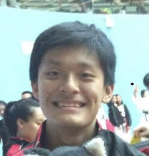
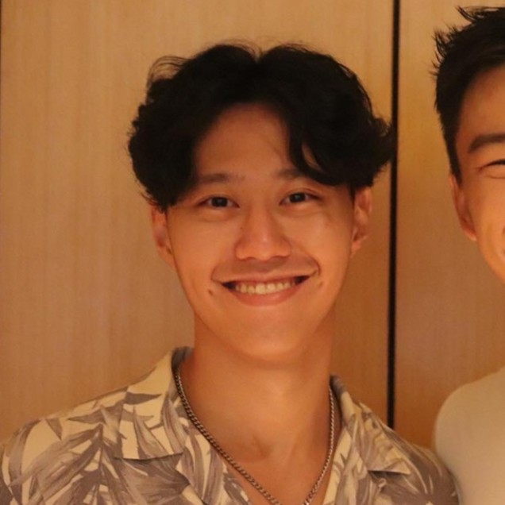
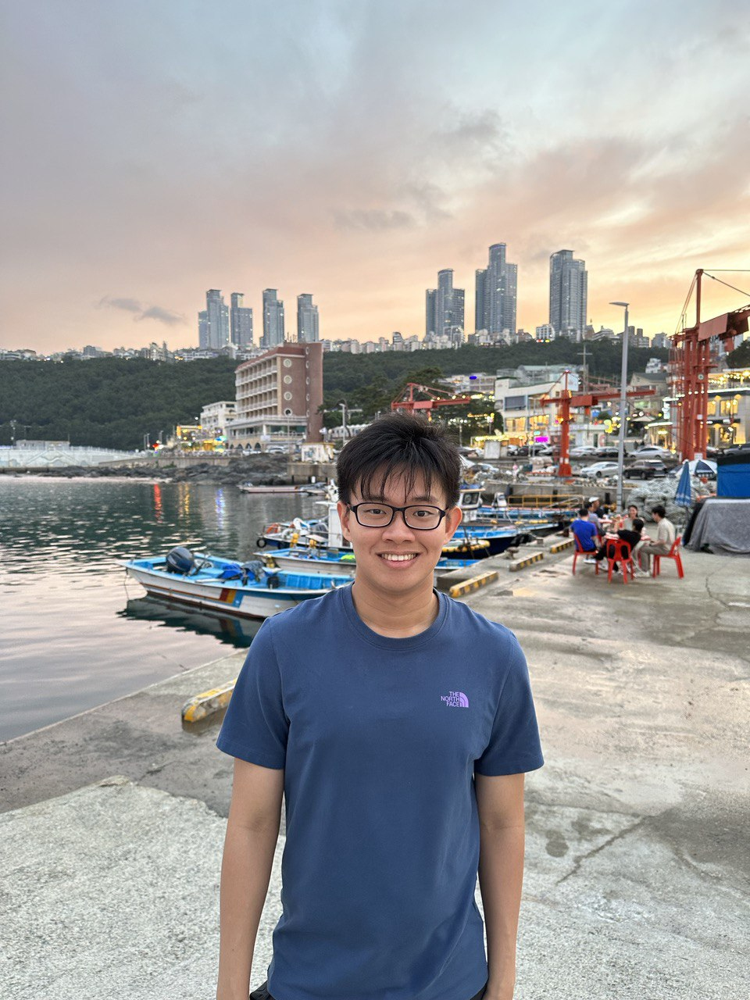
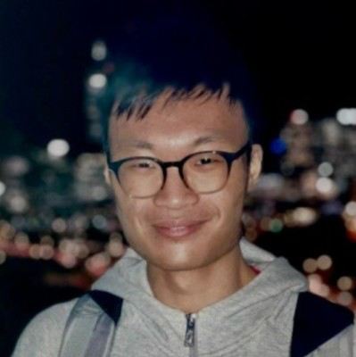

We are a team based in the [School of Computing, National University of Singapore](http://www.comp.nus.edu.sg).

You can reach us at the email `seer[at]comp.nus.edu.sg`

## Project team

### Lim Wei Hern

[[github](https://github.com/nrehiew)]
[[portfolio](team/nrehiew.md)]

* Role: Integration

### Peng Victor M X

[[github](http://github.com/victorpengmx)]
[[portfolio](team/nrehiew.md)]

* Role: Developer

### Gerald Ng

[[github](https://github.com/geraldngjx)]
[[portfolio](team/geraldngjx.md)]

* Role: Developer

### Ryan Tan

[[github](https://github.com/ryantzr1)]
[[portfolio](team/ryantzr1.md)]

* Role: Product
* Responsibilities: In charge of UX and product functionality

### Ian Tay

[[github](http://github.com/johndoe)]
[[portfolio](team/nrehiew.md)]

* Role: Developer
* Responsibilities: UI
