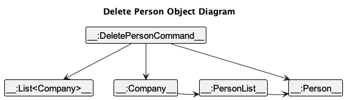
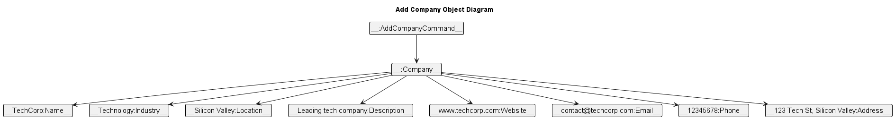
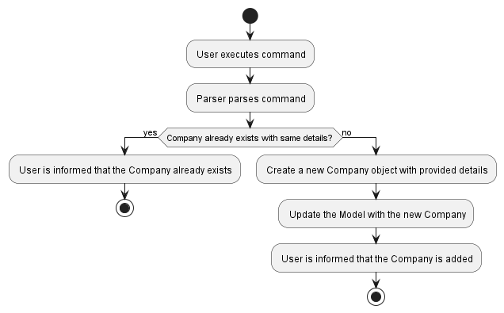
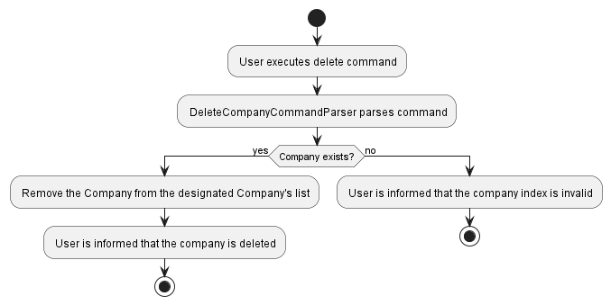
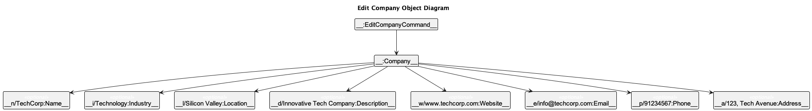
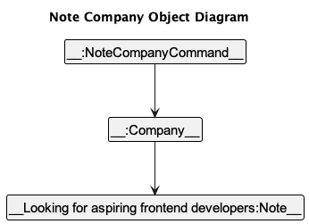
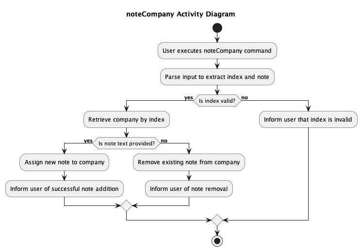
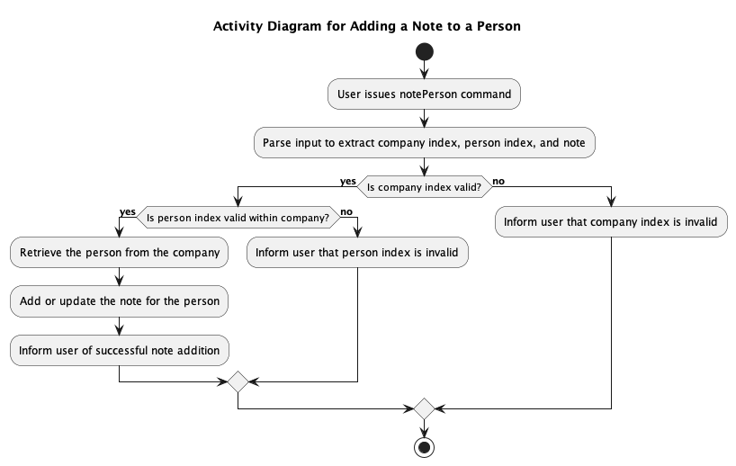
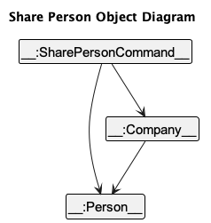
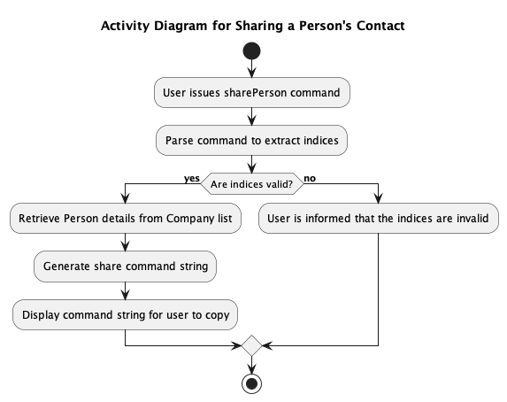

# Connectify Developer Guide

--------------------------------------------------------------------------------------------------------------------

## Table Of Contents
<!-- TOC -->
* [Introduction](#introduction)
    * [Acknowledgements](#acknowledgements)
    * [Setting up, getting started](#setting-up-getting-started)
* [Design](#design)
    * [Architecture](#architecture)
    * [UI component](#ui-component)
    * [Logic component](#logic-component)
    * [Model component](#model-component)
    * [Storage component](#storage-component)
    * [Common classes](#common-classes)
* [Implementation](#implementation)
    * [List Features](#list-features)
    * [Add Person Feature](#add-person-feature--addperson)
    * [Delete Person Feature](#delete-person-feature--deleteperson)
    * [Add Company Feature](#add-company-feature--addcompany)
    * [Delete Company Feature](#delete-company-feature--deletecompany)
    * [Edit Company Feature](#edit-company-feature--editcompany)
    * [Add Note to Company Feature](#add-note-to-company-feature--notecompany)
    * [Add Note to Person Feature](#add-note-to-person-feature--noteperson)
    * [Share Person's Contact Feature](#share-persons-contact-feature--shareperson)
    * [[Proposed] Undo/redo feature](#proposed-undoredo-feature)
    * [[Proposed] Data archiving](#proposed-data-archiving)
* [Documentation, logging, testing, configuration, dev-ops](#documentation-logging-testing-configuration-dev-ops)
* [Appendix: Requirements](#appendix-requirements)
    * [Product Scope](#product-scope)
    * [User Stories](#user-stories)
    * [Use Cases](#use-cases)
    * [Non-Funtional Requirements](#non-functional-requirements)
    * [Glossary](#glossary)
* [Appendix: Instructions for manual testing](#appendix-instructions-for-manual-testing)
    * [Launch and shutdown](#launch-and-shutdown)
    * [Deleting a person](#deleting-a-person)
    * [Saving data](#saving-data)
<!-- TOC -->

--------------------------------------------------------------------------------------------------------------------
## Introduction

--------------------------------------------------------------------------------------------------------------------

### **Acknowledgements**

* [JavaFX](https://openjfx.io/)
* [Jackson](https://github.com/FasterXML/jackson)
* [JUnit5](https://github.com/junit-team/junit5)
* [AddressBook-Level 3 (AB-3)](https://se-education.org/addressbook-level3/)

--------------------------------------------------------------------------------------------------------------------

### **Setting up, getting started**

Refer to the guide [_Setting up and getting started_](SettingUp.md).

--------------------------------------------------------------------------------------------------------------------

## **Design**

### Architecture

<puml src="diagrams/ArchitectureDiagram.puml" width="280" />

The ***Architecture Diagram*** given above explains the high-level design of the App.

Given below is a quick overview of main components and how they interact with each other.

**Main components of the architecture**

**`Main`** (consisting of classes [`Main`](https://github.com/se-edu/addressbook-level3/tree/master/src/main/java/seedu/address/Main.java) and [`MainApp`](https://github.com/se-edu/addressbook-level3/tree/master/src/main/java/seedu/address/MainApp.java)) is in charge of the app launch and shut down.
* At app launch, it initializes the other components in the correct sequence, and connects them up with each other.
* At shut down, it shuts down the other components and invokes cleanup methods where necessary.

The bulk of the app's work is done by the following four components:

* [**`UI`**](#ui-component): The UI of the App.
* [**`Logic`**](#logic-component): The command executor.
* [**`Model`**](#model-component): Holds the data of the App in memory.
* [**`Storage`**](#storage-component): Reads data from, and writes data to, the hard disk.

[**`Commons`**](#common-classes) represents a collection of classes used by multiple other components.

**How the architecture components interact with each other**

The *Sequence Diagram* below shows how the components interact with each other for the scenario where the user issues the command `deletePerson 1 1`.

<puml src="diagrams/ArchitectureSequenceDiagram.puml" width="574" />

Each of the four main components (also shown in the diagram above),

* defines its *API* in an `interface` with the same name as the Component.
* implements its functionality using a concrete `{Component Name}Manager` class (which follows the corresponding API `interface` mentioned in the previous point.

For example, the `Logic` component defines its API in the `Logic.java` interface and implements its functionality using the `LogicManager.java` class which follows the `Logic` interface. Other components interact with a given component through its interface rather than the concrete class (reason: to prevent outside component's being coupled to the implementation of a component), as illustrated in the (partial) class diagram below.

<puml src="diagrams/ComponentManagers.puml" width="300" />

The sections below give more details of each component.

### UI component

The UI component in this application provides the graphical user interface for interacting with Connectify. It consists of several key classes, including `MainWindow`, `CommandBox`, `ResultDisplay`, `EntityListPanel`, `StatusBarFooter`, `PersonCard` and `CompanyCard`. All these classes, along with `MainWindow`, inherit from the abstract `UiPart` class, which captures the common functionalities between parts of the GUI.

The UI component is built using the JavaFX UI framework, and the layout of UI parts is defined in matching `.fxml` files located in the `src/main/resources/view` folder. For example, the layout of the `MainWindow` is specified in `MainWindow.fxml`.

#### Class Structure

The main classes and their relationships in the UI component are as follows:

<puml src="diagrams/UiClassDiagram.puml" alt="Structure of the UI Component"/>

The UI consists of the following parts:
- `Ui`: The entry point of the UI component. It orchestrates the various UI elements.
- `MainWindow`: The primary UI window that houses all UI elements.
- `CommandBox`: The input box for user commands.
- `ResultDisplay`: The area that displays command results and system messages.
- `EntityListPanel`: The panel that displays a list of entities (e.g., persons and companies).
- `StatusBarFooter`: The status bar that shows system information.
- `UiPart`: An abstract class that captures common functionalities for UI components. It is inherited by all UI components.

#### Interaction with Other Components

The UI component interacts with other components in the application to fulfill its role:

- **Logic Component**: The UI component executes user commands by delegating them to the Logic component. It relies on the Logic component to process commands and provide responses.

- **Model Component**: The UI component listens for changes to the Model data, specifically the list of persons and companies to display. When the Model data is modified, the UI updates to reflect those changes. It displays information about persons and companies that reside in the Model component.

- **Dependencies**: The UI component has dependencies on various classes within the Model component to display data effectively.

#### Usage

To use the UI component effectively, follow these guidelines:

1. **Starting the UI**: To start the UI, the application initializes the `UiManager`, which is the entry point of the UI. It also creates a `MainWindow` and the associated UI elements.

2. **User Interaction**: Users interact with the UI by entering commands in the `CommandBox`. The UI component processes these commands and displays the results in the `ResultDisplay`.

3. **Display of Entities**: The `EntityListPanel` displays a list of entities. An `Entity` is either a Person or a Company. The `EntityListPanel` displays the entities in a scrollable list. The user can scroll through the list to view all the entities.

4. **Listening for Model Changes**: The UI component actively listens for changes to the Model data. When the Model is updated, the UI reflects these changes, ensuring that the user sees the most current data.

5. **Error Handling**: The UI component handles errors gracefully and provides informative messages to the user when issues occur. These error messages are customised to the specific command the user has provided.

6. **Extending UI Components**: Developers can extend or modify existing UI components by creating new classes that inherit from UiPart. This allows for the addition of new GUI elements and functionality, making it easy to customize and enhance the user interface.

7. **Layout and Styling**: The layout of UI components is defined in matching `.fxml` files located in the `src/main/resources/view` folder. For example, the layout of the `MainWindow` is specified in `MainWindow.fxml`. The styling of UI components is defined in matching `.css` files located in the same folder. For example, the styling of the `MainWindow` is specified in `MainWindow.css`.


#### External Resources

- The API of this component is specified in [`Ui.java`](https://github.com/AY2324S1-CS2103T-T15-4/tp/blob/master/src/main/java/connectify/ui/Ui.java).

- The layouts of UI parts are defined in matching `.fxml` files in the `src/main/resources/view` folder.

- For specific details about the implementation of the `MainWindow`, refer to [`MainWindow.java`](https://github.com/AY2324S1-CS2103T-T15-4/tp/blob/master/src/main/java/connectify/ui/MainWindow.java).


### Logic component

**API** : [`Logic.java`](https://github.com/se-edu/addressbook-level3/tree/master/src/main/java/seedu/address/logic/Logic.java)

Here's a (partial) class diagram of the `Logic` component:

<puml src="diagrams/LogicClassDiagram.puml" width="550"/>

The sequence diagram below illustrates the interactions within the `Logic` component, taking `execute("deletePerson 1 1")` API call as an example.

<puml src="diagrams/DeleteSequenceDiagram.puml" alt="Interactions Inside the Logic Component for the `deletePerson 1 1` Command" />

<box type="info" seamless>

**Note:** The lifeline for `DeletePersonCommandParser` should end at the destroy marker (X) but due to a limitation of PlantUML, the lifeline reaches the end of diagram.
</box>

How the `Logic` component works:

1. When `Logic` is called upon to execute a command, it is passed to an `ConnectifyParser` object which in turn creates a parser that matches the command (e.g., `DeletePersonCommandParser`) and uses it to parse the command.
1. This results in a `Command` object (more precisely, an object of one of its subclasses e.g., `DeletePersonCommand`) which is executed by the `LogicManager`.
1. The command can communicate with the `Model` when it is executed (e.g. to delete a person).
1. The result of the command execution is encapsulated as a `CommandResult` object which is returned back from `Logic`.

Here are the other classes in `Logic` (omitted from the class diagram above) that are used for parsing a user command:

<puml src="diagrams/ParserClasses.puml" width="600"/>

How the parsing works:
* When called upon to parse a user command, the `ConnectifyParser` class creates an `XYZCommandParser` (`XYZ` is a placeholder for the specific command name e.g., `AddPersonCommandParser`) which uses the other classes shown above to parse the user command and create a `XYZCommand` object (e.g., `AddPersonCommand`) which the `ConnectifyParser` returns back as a `Command` object.
* All `XYZCommandParser` classes (e.g., `AddPersonCommandParser`, `DeletePersonCommandParser`, ...) inherit from the `Parser` interface so that they can be treated similarly where possible e.g, during testing.

### Model component
**API** : [`Model.java`](https://github.com/AY2324S1-CS2103T-T15-4/tp/blob/master/src/main/java/connectify/model/Model.java)

<puml src="diagrams/ModelClassDiagram.puml" width="450" />

The main entities of Connectify are a `Person` and `Company` which both inherit from the `Entity` class. Such a relationship is to allow either a `Person` or `Company` to be displayed in the UI.
This relationship is modelled in the following diagram:


The `Model` component,

* stores Connectify data i.e., all `Person` objects (which are contained in a `UniquePersonList` object) and all `Company` objects (which are contained in a `UniqueCompanyList` object).
* stores the currently 'selected' `Person` objects (e.g., results of a search query) as a separate _filtered_ list which is exposed to outsiders as an unmodifiable `ObservableList<Person>` that can be 'observed' e.g. the UI can be bound to this list so that the UI automatically updates when the data in the list change.
* stores a `UserPref` object that represents the user’s preferences. This is exposed to the outside as a `ReadOnlyUserPref` objects.
* does not depend on any of the other three components (as the `Model` represents data entities of the domain, they should make sense on their own without depending on other components)

### Storage component

**API** : [`Storage.java`](https://github.com/AY2324S1-CS2103T-T15-4/tp/blob/master/src/main/java/connectify/storage/Storage.java)

<puml src="diagrams/StorageClassDiagram.puml" width="550" />

The `Storage` component,
* can save both address book data and user preference data in JSON format, and read them back into corresponding objects.
* inherits from both `AddressBookStorage` and `UserPrefStorage`, which means it can be treated as either one (if only the functionality of only one is needed).
* depends on some classes in the `Model` component (because the `Storage` component's job is to save/retrieve objects that belong to the `Model`)

### Common classes

Classes used by multiple components are in the `connectify.commons` package.

--------------------------------------------------------------------------------------------------------------------

## **Implementation**

This section describes some noteworthy details on how certain features are implemented.

### List Features `list`/`companies`/`people`

#### Implementation

The mechanism is facilitated by `ListAllCommand`/`ListCompaniesCommand`/`ListPeopleCommand` and `ConnectifyParser` in the `Logic` component, and works as described below.

Upon receiving a valid user input for the list command, `ConnectifyParser` returns a new `ListAllCommand`/`ListCompaniesCommand`/`ListPeopleCommand` object.

The `ListAllCommand` object invokes `updateFilteredPersonList` and `updateFilteredCompanyList` in `ModelManager` in the `Model` component with the predicates `PREDICATE_SHOW_ALL_PERSONS` and `PREDICATE_SHOW_ALL_COMPANIES` to communicate to the Model to display all Companies and Persons. Note that this command does not modify the internal list of Companies and Persons in the Model, only the displayed list.

The `ListCompaniesCommand` object invokes `updateFilteredCompanyList` in `ModelManager` in the `Model` component with the predicates `PREDICATE_SHOW_ALL_COMPANIES` to communicate to the Model to display all Companies. Note that this command does not modify the internal list of Companies in the Model, only the displayed list.

The `ListAllPeopleCommand` object invokes `updateFilteredPersonList` in `ModelManager` in the `Model` component with the predicates `PREDICATE_SHOW_ALL_PERSONS` to communicate to the Model to display all Persons. Note that this command does not modify the internal list of Persons in the Model, only the displayed list.

If the list is empty, `execute` in the list command returns a `CommandResult` with `EMPTY_LIST_MESSAGE` or `MESSAGE_SUCCESS` otherwise.

The sequence diagram below illustrates the events that take place during the execution of `ListALlCommand`. The other two commands are similar.


### Add Person Feature: `addPerson`

#### Implementation

This feature is facilitated by the `AddPersonCommand` and `AddPersonCommandParser` in the `Logic` component, and works as described below.

When given valid user input, the `AddPersonCommandParser` will create a new `Person` object to add to the address book in the specified company.

Consider a scenario where the user wishes to add a new contact to a specific company with various details. The `AddPersonCommand` takes in various parameters, such as name, phone, email, address, and optional tags, to create a new `Person` object.

To ensure that a contact is added to the correct company, the command also takes an `Index` parameter specifying the company where the contact should be added. This ensures that the contact is associated with the intended company.


Consider an example of a valid `addPerson` command:

```plaintext
addPerson n/John Doe p/98765432 e/johnd@example.com a/311, Clementi Ave 2, #02-25 t/friends t/owesMoney c/1
```

The new objects in the final internal state after this example has been parsed are shown in the object diagram above.

The following activity diagrams detail the behavior of Connectify when a user inputs an addPerson command with valid syntax to be executed.

The AddPersonCommand also handles scenarios where a person with the same details already exists in the address book or the company specified via the company index parameter does not exist. In such cases, the command throws a CommandException with an error message to inform the user.


<div style="page-break-after: always;"></div>

### Delete Person Feature: `deletePerson`

#### Implementation

This feature is facilitated by the `DeletePersonCommand` and `DeletePersonCommandParser` in the `Logic` component, and works as described below.

When given valid inputs, `the DeletePersonCommandParser` will delete a `Person` object from a particular company list.

Consider a scenario where the user wishes to delete a person from a particular company list.

It requires two `Index` parameters: one for the company and another for the person within that company.

The command first validates company index to ensure the company is present in the system.

It then validates person index to ensure that the person selected is indeed in that company's list.

If valid, the person is removed from the designated company's list, and subsequently, from the address book.



Consider an example of a valid `deletePerson` command:

```plaintext
deletePerson 1 1
```

The new objects in the final internal state after this example has been parsed are shown in the object diagram above.

The following activity diagrams detail the behavior of Connectify when a user inputs an deletePerson command with valid syntax to be executed.

The DeletePersonCommand also handles scenarios where a person is not part of a company or company index does not exist in the range of companies. In such cases, the command throws a CommandException with an error message to inform the user.


<div style="page-break-after: always;"></div>

### Add Company Feature: `addCompany`

#### Implementation

This feature is facilitated by the `AddCompanyCommand` and `AddCompanyCommandParser` in the `Logic` component, and works as described below.

When given valid user input, the `AddCompanyCommandParser` will create a new `Company` object to add to the address book.

Consider a scenario where the user wishes to add a new company with various details. The `AddCompanyCommand` takes in various parameters, such as name, industry, location, description, website, email, phone, address
to create a new `Company` object.



Consider an example of a valid `addCompany` command:

```plaintext
addCompany n/TechCorp i/Technology l/Silicon Valley d/Leading tech company w/www.techcorp.com e/contact@techcorp.com p/12345678 a/123 Tech St, Silicon Valley
```

The new objects in the final internal state after this example has been parsed are shown in the object diagram above.

The following activity diagrams detail the behavior of Connectify when a user inputs an addCompany command with valid syntax to be executed.

The AddCompanyCommand also handles scenarios where a company with the same details already exists in the address book. In such cases, the command throws a CommandException with an error message to inform the user.



<div style="page-break-after: always;"></div>

### Delete Company Feature: `deleteCompany`

#### Implementation

This feature is facilitated by the `DeleteCompanyCommand` and `DeleteCompanyCommandParser` in the `Logic` component, and works as described below.

When given valid inputs, `the DeleteCompanyCommandParser` will delete a `Company` object.

Consider a scenario where the user wishes to delete a company.

It requires a `targetIndex` parameter. This validates company index to ensure the company is present in the system.

If valid, the company is removed from the address book.


Consider an example of a valid `deleteCompany` command:

```plaintext
deleteCompany 1
```

The new objects in the final internal state after this example has been parsed are shown in the object diagram above.

The following activity diagrams detail the behavior of Connectify when a user inputs a deleteCompany command with valid syntax to be executed.

The DeleteCompanyCommand also handles scenarios where a company index does not exist in the range of companies. In such cases, the command throws a CommandException with an error message to inform the user.



<div style="page-break-after: always;"></div>

### Edit Company Feature: `editCompany`

#### Implementation

This feature is facilitated by the `EditCompanyCommand` and `EditCompanyCommandParser` in the `Logic` component, and works as described below.

When given valid inputs, `the EditCompanyCommandParser` will edit a `Company` object.

Consider a scenario where the user wishes to edit a company.

It requires a `CompanyIndex` parameter. This validates company index to ensure the company is present in the system.

If valid, the company's details will be updated in the address book.



Consider an example of a valid `editCompany` command:

```plaintext
editCompany 1 n/TechCorp p/91234567 e/techcorp@gmail.com a/123, Jurong West Ave 6, #08-111
```

The new objects in the final internal state after this example has been parsed are shown in the object diagram above.

The following activity diagrams detail the behavior of Connectify when a user inputs an editCompany command with valid syntax to be executed.

The EditCompanyCommand also handles scenarios where a company index does not exist in the range of companies. In such cases, the command throws a CommandException with an error message to inform the user.


<div style="page-break-after: always;"></div>

### Edit Person Feature: `editPerson`

#### Implementation

This feature is implemented by the `EditPersonCommand` and `EditPersonCommandParser` within the `Logic` component of Connectify.

The process is initiated when the user inputs a valid command to edit a person's details. The `EditPersonCommandParser` analyses the input and constructs an `EditPersonCommand`, which, upon execution, updates the attributes of the specified `Person` object.

The `editPerson` command requires an index to identify the target person within the displayed person list of a company. Optionally, it may include a company index to specify which company the person is associated with, and any combination of fields to be updated for the person.

Here's how the command operates:

1. The user inputs the `editPerson` command with the appropriate indexes and details to be updated.
2. The parser validates the indexes and parses the fields to be updated.
3. If the indexes and fields are valid, the `EditPersonCommand` is executed to update the person's details in the address book.

Consider a scenario where the user wants to update the name, phone number, and email of a person listed as the first contact within a company:

```plaintext
editPerson 1 c/1 n/NewName p/98765432 e/newemail@example.com
```

Should there be any issues, such as invalid indexes or missing fields, the EditPersonCommand throws a CommandException to notify the user.

<div style="page-break-after: always;"></div>

### Add Note to Company Feature: `noteCompany`

#### Implementation

This feature is implemented by the `NoteCompanyCommand` and `NoteCompanyCommandParser` within the `Logic` component.

When the user provides valid input, the `NoteCompanyCommandParser` interprets the input to execute an `NoteCompanyCommand`, which in turn adds a note to a specific `Company` object in the address book.

Assume a user wants to add a note to a company's record. The `noteCompany` command requires the index of the company in the displayed list and the note content as parameters.



Consider a scenario where the user wishes to add a note indicating that a company is seeking frontend developers. The command input would be as follows:

```plaintext
noteCompany 1 r/Looking for aspiring frontend developers.
```
Upon execution, the NoteCompanyCommand appends the note to the company at the specified index. The object diagram above illustrates the final internal state after this example has been parsed.

The behavior of Connectify upon receiving a noteCompany command is described in the following activity diagram.

The NoteCompanyCommand also handles cases where the provided company index is not valid. It could be that the index does not correspond to any company in the current list view, or it is not a positive integer. Under such circumstances, the command throws a CommandException to inform the user.



<div style="page-break-after: always;"></div>

### Add Note to Person Feature: `notePerson`

#### Implementation

This feature is implemented by the `NotePersonCommand` and `NotePersonCommandParser` within the `Logic` component.

When the user provides valid input, the `NotePersonCommandParser` interprets the input to execute an `NotePersonCommand`, which in turn adds a note to a specific `Person` object in the address book.

To ensure that a note is added to the person in the correct company, the command also takes an `Index` parameter specifying the company where the person note should be added. This ensures that the person note is associated with the intended company.

Assume a user wants to add a note to a company's record. The `notePerson` command requires the index of the company in the displayed list and the note content as parameters.


Consider a scenario where the user wishes to add a note indicating that a person likes to swim. The command input would be as follows:

```plaintext
notePerson 1 1 r/Likes to swim.
```
Upon execution, the NotePersonCommand appends the note to the person at the specified person index, corresponding to the company at the specified company index. The object diagram above illustrates the final internal state after this example has been parsed.

The behavior of Connectify upon receiving a notePerson command is described in the following activity diagram.

The NotePersonCommand also handles cases where the provided person or company index is not valid. It could be that the index does not correspond to any company or person in the current list view, or it is not a positive integer. Under such circumstances, the command throws a CommandException to inform the user.



<div style="page-break-after: always;"></div>

## Ranking People by Priority Feature: `rank`

### Implementation

The ranking feature within Connectify is facilitated by the `RankCommand` and associated `RankCommandParser` in the `Logic` component. The `rank` command sorts the list of all persons by their assigned priority, allowing users to manage and view contacts based on importance.

#### Command Usage

To initiate the ranking process, the following command is used:

```plaintext
rank
```

This command does not require any additional parameters, simplifying its execution.

Upon successful execution, Connectify outputs the list of people ranked according to their priority.

The sequence of actions undertaken by the rank command is delineated in the activity diagram provided below. This includes the retrieval of all persons, their sorting by priority, and the updating of the user interface to reflect the changes.

The rankCommand also handles cases where there are no people in the address book. The command throws a CommandException to inform the user.


<div style="page-break-after: always;"></div>

### Share Person's Contact Feature: `sharePerson`

#### Implementation

This feature is enabled by the `SharePersonCommand` and `SharePersonCommandParser` within the `Logic` component.

With valid input, the parser constructs a `SharePersonCommand` which, upon execution, generates a command string for sharing a person's contact details.

The `sharePerson` command takes two parameters, `COMPANY_INDEX` and `PERSON_INDEX`, to identify the specific person within a company's list to be shared.



Consider a scenario where the user wishes to share a person's contact. The command input would be as follows:

```plaintext
sharePerson 1 1
```
Upon execution, the SharePersonCommand retrieves the person's details and generates a shareable command string of the person at the specified person index, corresponding to the company at the specified company index. This string is then displayed to the user for copying.
The object diagram above illustrates the final internal state after this example has been parsed.

The behavior of Connectify upon receiving a sharePerson command is described in the following activity diagram.

The SharePersonCommand also handles cases where the provided person or company index is not valid. It could be that the index does not correspond to any company or person in the current list view, or it is not a positive integer. Under such circumstances, the command throws a CommandException to inform the user.



<div style="page-break-after: always;"></div>


### Share Person's Contact Feature: `sharePerson`

#### Implementation

This feature is enabled by the `ShareCompanyCommand` and `ShareCompanyCommandParser` within the `Logic` component.

With valid input, the parser constructs a `ShareCompanyCommand` which, upon execution, generates a command string for sharing a company's contact details.

The `shareCompany` command takes the parameter `COMPANY_INDEX` to identify the specific company to be shared.

Consider a scenario where the user wishes to share a company's contact. The command input would be as follows:

```plaintext
shareCompany 1 
```
Upon execution, the ShareCompanyCommand retrieves the company's details and generates a shareable command string of the company at the specified company index. This string is then displayed to the user for copying.

The ShareCompanyCommand also handles cases where the provided person or company index is not valid. It could be that the index does not correspond to any company in the current list view, or it is not a positive integer. Under such circumstances, the command throws a CommandException to inform the user.

<div style="page-break-after: always;"></div>

### Finding Entities: `find`

#### Implementation

The `find` command, provided by the `FindCommand` and `FindCommandParser` within the `Logic` component, searches for and lists all entities that match the specified keywords in the Connectify database.

To look for entities containing "John" and "Doe":
```plaintext
find John Doe
```
A count of matched entities is displayed, and each matched entity is listed out.

The FindCommand also handles cases where there are no matches. 

<div style="page-break-after: always;"></div>


### Finding Companies: `companies`

#### Implementation

The `companies` command, provided by the `FindCompaniesCommand` and `FindCompaniesCommandParser` within the `Logic` component, searches for and lists all companies that match the specified keywords in the Connectify database.

To look for companies called "Facebook":
```plaintext
companies Facebook
```
A count of matched companies is displayed, and each matched company is listed out.

The FindCompaniesCommand also handles cases where there are no matches.

<div style="page-break-after: always;"></div>

### Finding People: `people`

#### Implementation

The `people` command, provided by the `FindPeopleCommand` and `FindPeopleCommandParser` within the `Logic` component, searches for and lists all companies that match the specified keywords in the Connectify database.

To look for people containing "John":
```plaintext
people john 
```
A count of matched people is displayed, and each matched person is listed out.

The FindPeopleCommand also handles cases where there are no matches.

<div style="page-break-after: always;"></div>


### Clearing the Database: `clear`

#### Implementation

The `clear` feature is managed by the `ClearCommand` in the `Logic` component. This command is utilized to remove all persons and companies from the Connectify database.

#### Command Usage
```plaintext
clear
```
After running this command, there will be confirmation that all entities have been removed. Cleared all persons and companies.

<div style="page-break-after: always;"></div>

### Seeking Help: `help`

#### Implementation

The `help` command is executed by the `HelpCommand` which provides users with assistance and information on using Connectify, including a link to the user guide.

#### Command Usage
```plaintext
help
```
When triggered, it presents a help window or a link to the user guide.

<div style="page-break-after: always;"></div>

## Exiting Connectify: `exit`

### Implementation

Implemented by the `ExitCommand`, this command terminates the Connectify application, closing the session safely.

#### Command Usage
```plaintext
exit
```

After running this command, the application closes.

<div style="page-break-after: always;"></div>

--------------------------------------------------------------------------------------------------------------------

## **Documentation, logging, testing, configuration, dev-ops**

* [Documentation guide](Documentation.md)
* [Testing guide](Testing.md)
* [Logging guide](Logging.md)
* [Configuration guide](Configuration.md)
* [DevOps guide](DevOps.md)

--------------------------------------------------------------------------------------------------------------------

## **Appendix: Requirements**

### Product scope

**Target user profile**:

* is a university student who has a need to manage a significant number of contacts
* prefer desktop apps over other types
* can type fast
* prefers typing to mouse interactions
* is reasonably comfortable using CLI apps
* prioritize tools and solutions that streamline their workflow

**Value proposition**: Manage contacts faster than a typical mouse/GUI driven app and offers an efficient solution to manage, categorize, and tag contacts, thus enhancing networking experiences and providing quick access to contact information.

### User stories

Priorities: High (must have) - `* * *`, Medium (nice to have) - `* *`, Low (unlikely to have) - `*`

| Priority | As a …​                               | I want to …​                        | So that I can…​                                                         |
|----------|---------------------------------------|-------------------------------------|-------------------------------------------------------------------------|
| `* * *`  | new user                              | see usage instructions              | refer to instructions when I forget how to use the App                  |
| `* * *`  | user                                  | add a new company                   |                                                                         |
| `* * *`  | user                                  | add a new person                    |                                                                         |
| `* * *`  | user                                  | edit a company                      | update the details of the company easily                                |
| `* * *`  | user                                  | edit a person                       | update the details of the person easily                                 |
| `* * *`  | user                                  | delete a company                    | remove a company that I no longer need                                  |
| `* * *`  | user                                  | delete a person                     | remove a person that I no longer need                                   |
| `* *`    | user                                  | add notes to a company              | add and view more information on the company                            |
| `* *`    | user                                  | add notes to a person               | add and view more information on the person                             |
| `* *`    | user                                  | share a company                     | share the company details with others                                   |
| `* *`    | user                                  | share a person                      | share the person details with others                                    |
| `* * *`  | user                                  | find a contact by name              | locate details of contacts without having to go through the entire list |
| `* * *`  | user                                  | list all contacts                   | know what persons and companies I have contacts of                      |
| `* * *`  | user                                  | list all companies                  | know what companies I have contacts of                                  |
| `* * *`  | user                                  | list all people                     | know who are the people I have contacts with                            |
| `* * *`  | user                                  | exit the application                |                                                                         |
| `* * `   | user                                  | assign a priority value to a person | rank persons based on the priority                                      |
| `* *`    | user with many persons in Connnectify | sort persons by priority            | easily find persons who are more important                              |
| `* *`    | user                                  | clear all contacts                  | restart with a fresh database                                           |

*{More to be added}*

### Use cases

(For all use cases below, the **System** is `Connectify` and the **Actor** is the `user`, unless specified otherwise)

**UC01: Add a company**

**MSS**

1. User requests to add a new company with the necessary details of the company.
2. Connectify creates a new company object with the provided details.

   Use case ends.

**Extensions**

* 1a. User provides incomplete or invalid details.

    * 1a1. Connectify shows an error message.

      Use case ends.

* 1b. A company with the same details already exists in the address book.

    * 1b1. Connectify shows an error message.

      Use case ends.

**UC02: Delete a company**

**MSS**

1.  User requests to list companies.
2.  Connectify shows a list of companies.
3.  User requests to delete a specific company in the list based on index.
4.  Connectify deletes the company.

    Use case ends.

**Extensions**

* 2a. The list is empty.

  Use case ends.

* 3a. User provides an invalid index.

    * 3a1. Connectify shows an error message.

      Use case resumes at step 3.

**UC03: Edit a Company**

**MSS**

1. User requests to list companies.
2. Connectify shows a list of companies.
3. User requests to edit a company in the list with the new necessary details.
4. Connectify updates the company object with the new provided details.

   Use case ends.

**Extensions**

* 2a. The list is empty.

  Use case ends.

* 3a. User provides an invalid index.

    * 3a1. Connectify shows an error message.

      Use case resumes at step 3.

* 3b. User provides incomplete or invalid details.

    * 3b1. Connectify shows an error message.

      Use case resumes at step 3.

* 3c. A company with the same details already exists in the address book.

    * 3c1. Connectify shows an error message.

      Use case resumes at step 3.

**UC04: List Companies**

**MSS**

1.  User requests to list companies
2.  Connectify shows a list of companies

    Use case ends.

**Extensions**

* 2a. The list is empty.

  Use case ends.

**UC05: Adding a note to a company**

**MSS**

1.  User requests to list companies
2.  Connectify shows a list of companies
3.  User requests to add notes to a specific company in the list
4.  Connectify adds the notes to the specified company

    Use case ends.

**Extensions**

* 2a. The list is empty.

  Use case ends.

* 3a. The given index is invalid.

    * 3a1. Connectify shows an error message.

      Use case resumes at step 3.

**UC06: Deleting a note from a company**

**MSS**

1.  User requests to list companies
2.  Connectify shows a list of companies
3.  User requests to delete notes from a specific company in the list
4.  Connectify deletes the notes from the specified company

    Use case ends.

**Extensions**

* 2a. The list is empty.

  Use case ends.

* 3a. The given index is invalid.

    * 3a1. Connectify shows an error message.

      Use case resumes at step 3.

**UC07: Share a company**

**MSS**

1.  User requests to list companies
2.  Connectify shows a list of companies
3.  User requests to share details of a specific company in the list
4.  Connectify shows the command to add the specified company

    Use case ends.

**Extensions**

* 2a. The list is empty.

  Use case ends.

* 3a. The given index is invalid.

    * 3a1. Connectify shows an error message.

      Use case resumes at step 3.

**UC08: Add a Person**

**MSS**

1. User requests to add a new person with the necessary details of the person.
2. Connectify creates a new person object with the provided details and associates it with the specified company.

    Use case ends.

**Extensions**

* 1a. User provides incomplete or invalid details.

    * 1a1. Connectify shows an error message.

      Use case ends.

* 1b. A person with the same details already exists in the address book.

    * 1b1. Connectify shows an error message.

      Use case ends.

**UC09: Delete a person**

**MSS**

1.  User requests to list persons.
2.  Connectify shows a list of contacts.
3.  User requests to delete a specific contact in the list by index.
4.  Connectify deletes the contact.

    Use case ends.

**Extensions**

* 2a. The list is empty.

  Use case ends.

* 3a. The given index is invalid.

    * 3a1. Connectify shows an error message.

      Use case resumes at step 3.

**UC10: Edit a Person**

**MSS**

1. User requests to list persons.
2. Connectify shows a list of persons.
3. User requests to edit a person in the list with the new necessary details.
4. Connectify updates the person with the new provided details.

   Use case ends.

**Extensions**

* 2a. The list is empty.

  Use case ends.

* 3a. User provides incomplete or invalid details.

    * 3a1. Connectify shows an error message.

      Use case resumes at step 3.

* 3b. A person with the same details already exists in the address book.

    * 3b1. Connectify shows an error message.

      Use case resumes at step 3.

**UC11: List all persons**

**MSS**

1.  User requests to list persons
2.  Connectify shows a list of persons

    Use case ends.

**Extensions**

* 2a. The list is empty.

  Use case ends.

**UC12: Adding a note to a Person**

**MSS**

1.  User requests to list companies
2.  Connectify shows a list of persons associated with each company
3.  User requests to add notes to a specific person in a specific company
4.  Connectify adds the notes to the specified person

    Use case ends.

**Extensions**

* 2a. The list is empty.

  Use case ends.

* 3a. The given company index is invalid.

    * 3a1. Connectify shows an error message.

      Use case resumes at step 3.

* 3b. The given person index is invalid.

    * 3b1. Connectify shows an error message.

      Use case resumes at step 3.

**UC13: Delete a note of a person**

**MSS**

1.  User requests to list companies.
2.  Connectify shows a list of persons associated with each company.
3.  User requests to delete notes from a specific person in a specific company.
4.  Connectify deletes the notes from the specified person.

    Use case ends.

**Extensions**

* 2a. The list is empty.

  Use case ends.

* 3a. The given company index is invalid.

    * 3a1. Connectify shows an error message.

      Use case resumes at step 3.

* 3b. The given person index is invalid.

    * 3b1. Connectify shows an error message.

      Use case resumes at step 3.

**UC14: Share a person**

**MSS**

1.  User requests to list companies
2.  Connectify shows a list of persons associated with each company
3.  User requests to share details of a specific person in a specific company
4.  Connectify shows the command to add the specified person

    Use case ends.

**Extensions**

* 2a. The list is empty.

  Use case ends.

* 3a. The given company index is invalid.

    * 3a1. Connectify shows an error message.

      Use case resumes at step 3.

* 3b. The given person index is invalid.

    * 3b1. Connectify shows an error message.

      Use case resumes at step 3.

**UC15: Sort all persons by their rank**

**MSS**

1.  User requests to sort persons by their rank
2.  Connectify shows a list of people ranked by their priority

Use case ends.

**Extensions**

* 2a. The list is empty.

  Use case ends.

**UC16: Find a contact**

**MSS**

1.  User requests to find a specific contact by a keyword
2.  Connectify shows a list of contacts that contain the keyword

    Use case ends.

**Extensions**

* 2a. The list is empty.

  Use case ends.

* 2b. There are no contacts that contain the keyword.

    * Connectify displays a message indicating that there are no contacts that contain the keyword. 

      Use case ends.

**UC17: Find a company**

**MSS**

1.  User requests to find a specific company by a keyword
2.  Connectify shows a list of companies that contain the keyword

    Use case ends.

**Extensions**

* 2a. The list is empty.

  Use case ends.

* 2b. There are no companies that contain the keyword.

    * Connectify displays a message indicating that there are no companies that contain the keyword. 

      Use case ends.

**UC18: Clear the database**

**MSS**

1.  User requests to clear all contacts
2.  Connectify clears all contacts from the address book

    Use case ends.

**UC19: Seek help**

**MSS**

1.  User requests help
2.  Connectify shows a list of commands available in Connectify

    Use case ends.

### Non-Functional Requirements

1.  Should work on any _mainstream OS_ as long as it has Java `11` or above installed.
2.  Should be able to hold up to 1000 persons without a noticeable sluggishness in performance for typical usage.
3.  A user with above average typing speed for regular English text (i.e. not code, not system admin commands) should be able to accomplish most of the tasks faster using commands than using the mouse.
4.  The application should be highly reliable, with minimal downtime and a low frequency of crashes or failures. It should be able to recover gracefully from unexpected errors and continue functioning without data loss.
5.  The software should be designed with maintainability in mind, allowing for easy updates, bug fixes, and enhancements. This includes well-organized code, clear documentation, and modular architecture.
6.  The Graphical User Interface (GUI) should be intuitive and responsive, and easy to use.
7.  Should maintain consistent performance as the number of concurrent users increases, ensuring efficient scalability.
8.  The application should be designed with user-friendly error messages, guiding users to troubleshoot issues effectively.
9.  The application should respond to user inputs within a defined timeframe to maintain a seamless user experience.
10. Ensure the underlying database is scalable to accommodate a growing amount of configuration data.

### Glossary

* **Mainstream OS**: Windows, Linux, Unix, OS-X
* **Private contact detail**: A contact detail that is not meant to be shared with others
* **CLI**: Command Line Interface
* **GUI**: Graphical User Interface
* **UI**: User Interface
* **API**: Application Programming Interface
* **MSS**: Main Success Scenario
* **Extension**: Alternative Scenario
* **Actor**: A user or another system that interacts with the system under consideration
* **System**: The software system under consideration
* **Contact**: A person that the user wants to keep track of
* **Priority**: A value that indicates the importance of a contact

--------------------------------------------------------------------------------------------------------------------

## **Appendix: Instructions for manual testing**

Given below are instructions to test the app manually.

<box type="info" seamless>

**Note:** These instructions only provide a starting point for testers to work on;
testers are expected to do more *exploratory* testing.

</box>

### Launch and shutdown

1. Initial launch

   1. Download the jar file and copy into an empty folder

   1. Double-click the jar file Expected: Shows the GUI with a set of sample contacts. The window size may not be optimum.

1. Saving window preferences

   1. Resize the window to an optimum size. Move the window to a different location. Close the window.

   1. Re-launch the app by double-clicking the jar file.<br>
       Expected: The most recent window size and location is retained.

<div style="page-break-after: always;"></div>

### Help

1. Showing the help window that contains a link to the User Guide.<br>
   Note: If you minimise the window, using the help command will not do anything. Do look for the minimised window in the taskbar of your computer!

    1. Test case: `help`, `help ...(any other text following)...`<br>
       Expected: Shows the help window successfully. The text following the `help` command is ignored.

<div style="page-break-after: always;"></div>

### Adding a person

1. Adding a person with valid inputs

    1. Test cases: refer to UG for examples<br>
       Expected: The corresponding person is added to Connectify.

1. Adding a person with insufficient information

    1. Test cases: `addPerson n/John Doe p/98765432`, `addPerson n/Jane Tan e/janet@example.com`, etc.<br>
       Expected: Connectify displays an error. No person is added.
       Reason: Insufficient information (other compulsory fields not input)

1. Adding a person with invalid inputs

    1. Test cases: `addPerson n/Alice Seah p/phone`, `addPerson n/Bob Lim e/email`, etc.<br>
       Expected: Connectify displays an error. No person is added.
       Reason: Phone number must be all numbers, email must be formatted as email@domain

1. Adding a duplicate person

    1. Prerequisites: Have a person named `Alex Yeoh` in the persons list

    1. Test case: `addPerson n/Alex Yeoh ...`<br>
       Expected: Conectify throws an error informing that there is already an `Alex Yeoh` in the list. No person is added.

<div style="page-break-after: always;"></div>

### Deleting a person

1. Deleting a person while all persons are displayed

   1. Prerequisites: List all persons using the `people` command. Multiple persons in the list.

   1. Test case: `deletePerson 1`<br>
      Expected: Connectify displays an error. No person is deleted.
      Reason: User must indicate both COMPANY_INDEX, and PERSON_INDEX to delete.

   1. Test case: `deletePerson 1 1`<br>
      Expected: First contact, from the first company, is deleted from the list. Details of the deleted contact shown in the status message.

   1. Test case: `deletePerson 0 1`<br>
      Expected: Connectify displays an error. No person is deleted.
      Reason: COMPANY_INDEX must be >= 1, <= number of companies.

   1. Test case: `deletePerson 1 0`<br>
      Expected: Connectify displays an error. No person is deleted.
      Reason: PERSON_INDEX must be >= 1, <= number of people.

   1. Other incorrect delete commands to try: `deletePerson`, `deletePerson x y` (where x and/or y is larger than the list size)<br>
      Expected: Similar to previous.

<div style="page-break-after: always;"></div>

### Editing a Person

1. Editing a person while all companies are displayed

    1. Prerequisites: List all companies using the `companies` command. One or more companies in the list, with one or more people in each company.

    1. Test case: `editPerson 1 ...(any other text following)...`<br>
       Expected: Connectify displays an error. No person is edited.
       Reason: PERSON_INDEX is indicated. However, user must also indicate COMPANY_INDEX, from which to find the Person to edit.

    1. Test case: `editPerson 1 c/1 n/Jane Doe`<br>
       Expected: Name of first contact, from the first company, is edited to "Jane Doe". Full details of the edited contact shown in the status message.

    1. Test case: `editPerson 1 c/1 p/91820340`<br>
       Expected: Phone number of first contact, from the first company, is edited to "91820340". Full details of the edited contact shown in the status message.

    1. Test case: `editPerson 0 c/1 ...(any other text following)...`<br>
       Expected: Connectify displays an error. No person is edited.
       Reason: PERSON_INDEX must be >= 1, <= number of people within the company.

    1. Test case: `editPerson 1 c/0 ...(any other text following)...`<br>
       Expected: Connectify displays an error. No person is edited.
       Reason: COMPANY_INDEX must be >= 1, <= number of companies.

    1. Other incorrect delete commands to try: `editPerson`, `editPerson x c/y` (where x and/or y is larger than the list size)<br>
       Expected: Similar to previous.

<div style="page-break-after: always;"></div>

### Adding a note to a Person

1. Adding notes to a person while all companies are displayed

    1. Prerequisites: List all companies using the `companies` command. One or more companies in the list, with one or more people in each company.

    1. Test case: `notePerson 1`<br>
       Expected: Connectify displays an error. No person information is changed.
       Reason: COMPANY_INDEX is indicated. However, user must also indicate PERSON_INDEX, from which to find the Person to add notes to.

    1. Test case: `notePerson 1 1 r/Likes to swim`<br>
       Expected: Note is added to first contact, from the first company, that the contact "Likes to swim". Details of the contact shown in the status message.

    1. Test case: `notePerson 0 ...(any other text following)...`<br>
       Expected: Connectify displays an error. No person information is changed.
       Reason: COMPANY_INDEX must be >= 1, <= number of companies.

    1. Test case: `notePerson 1 0 ...(any other text following)...`<br>
       Expected: Connectify displays an error. No person is edited.
       Reason: PERSON_INDEX must be >= 1, <= number of people within the company.

    1. Other incorrect delete commands to try: `notePerson`, `notePerson x y` (where x and/or y is larger than the list size)<br>
       Expected: Similar to previous.

<div style="page-break-after: always;"></div>

### Sharing instructions on how to add a Person

1. Sharing instructions on how to add a Person while all persons are displayed

    1. Prerequisites: List all persons using the `people` command. Multiple persons in the list.

    1. Test case: `sharePerson 1 1`<br>
       Expected: Connectify converts the person card of the first person in the first company into text format, so that user can add the same Person to another address book.

    1. See "Deleting a person" above for some examples of unsuccessful calls of sharePerson.

<div style="page-break-after: always;"></div>

### Adding a company

1. Adding a company with valid inputs

    1. Test cases: refer to UG for examples<br>
       Expected: The corresponding company is added to Connectify.

1. Adding a company with insufficient information

    1. Test cases: `addCompany n/TechCorp`, `addCompany n/TechCorp l/Sim Lim Square`, etc.<br>
       Expected: Connectify displays an error. No company is added.
       Reason: Insufficient information (other compulsory fields not input)

1. Adding a company with invalid inputs

    1. Test cases: `addCompany n/Alice Pte Ltd p/phone`, `addCompany n/Bob and Co. e/email`, etc.<br>
       Expected: Connectify displays an error. No company is added.
       Reason: Phone number must be all numbers, email must be formatted as email@domain

1. Adding a duplicate company

    1. Prerequisites: Have a person named `CorpTech` in the companies list

    1. Test case: `addCompany n/CorpTech ...`<br>
       Expected: Conectify throws an error informing that there is already an `CorpTech` in the list. No company is added.

<div style="page-break-after: always;"></div>

### Deleting a company

1. Deleting a company while all companies are displayed

    1. Prerequisites: List all companies using the `companies` command. Multiple companies in the list.

    1. Test case: `deleteCompany 1`<br>
       Expected: First company is deleted from the list. Details of the deleted
       company shown in the status message. Any persons under that company will also
       be deleted.

    1. Test case: `deleteCompany 0`<br>
       Expected: Connectify displays an error. No company is deleted.
       Reason: COMPANY_INDEX must be >= 1, <= number of companies.

    1. Other incorrect delete commands to try: `deleteCompany`, `deleteCompany x` (where x is larger than the list size)<br>
       Expected: Similar to previous.

<div style="page-break-after: always;"></div>

### Editing a Company

1. Editing a company while all companies are displayed

    1. Prerequisites: List all companies using the `companies` command. One or more companies in the list.

    1. Test case: `editCompany 1 n/TechCorp`<br>
       Expected: Name of first company is edited to "TechCorp". Full details of the edited company card shown in the status message.

    1. Test case: `editCompany 1 p/91820340`<br>
       Expected: Phone number of first company is edited to "91820340". Full details of the edited company card shown in the status message.

    1. Test case: `editCompany 0 ...(any other text following)...`<br>
       Expected: Connectify displays an error. No company is edited.
       Reason: COMPANY_INDEX must be >= 1, <= number of companies.

    1. Other incorrect delete commands to try: `editCompany`, `editCompany x` (where x is larger than the list size)<br>
       Expected: Similar to previous.

<div style="page-break-after: always;"></div>

### Adding a note to a Company

1. Adding notes to a company while all companies are displayed

    1. Prerequisites: List all companies using the `companies` command. One or more companies in the list.

    1. Test case: `noteCompany 1 r/Looking for aspiring frontend developers`<br>
       Expected: Note is added to first company, that the company is "Looking for aspiring frontend developers". Full details of the edited company card shown in the status message.

    1. Test case: `noteCompany 0 ...(any other text following)...`<br>
       Expected: Connectify displays an error. No company information is changed.
       Reason: COMPANY_INDEX must be >= 1, <= number of companies.

    1. Other incorrect delete commands to try: `noteCompany`, `noteCompany x` (where x is larger than the list size)<br>
       Expected: Similar to previous.

<div style="page-break-after: always;"></div>

### Sharing instructions on how to add a Company

1. Sharing instructions on how to add a Company while all companies are displayed

    1. Prerequisites: List all companies using the `companies` command. Multiple companies in the list.

    1. Test case: `shareCompany 1`<br>
       Expected: Connectify converts the company card of the first company into text format, so that user can add the same Company to another address book.

    1. See "Deleting a company" above for some examples of unsuccessful calls of shareCompany.

<div style="page-break-after: always;"></div>

### Clear

1. Clearing all stored data in Connectify.

    1. Prerequisites: Connectify is populated with data.

    1. Test case: `clear`, `clear ...(any other text following)...`<br>
       Expected: Clears all stored data in Connectify. Clear will be successful even if Connectify has no data. The text following the `clear` command is ignored.

<div style="page-break-after: always;"></div>

### List/Display entities

1. Listing all entities (persons and companies)

    1. Test case: `list`, `list ...(any other text following)...`<br>
       Expected: All entities are listed. The text following the `list` command is ignored.

    1. Test case: Clear every entity using `clear`, then enter the command `list`<br>
       Expected: No entities listed.

1. Listing all people

    1. Test case: `people`, `people ...(any other text following)...`<br>
       Expected: All people are listed. The text following the `people` command is ignored.

    1. Test case: Clear every entity using `clear`, then enter the command `people`<br>
       Expected: No people listed.

1. Listing all companies

    1. Test case: `companies`, `companies ...(any other text following)...`<br>
       Expected: All companies are listed. The text following the `companies` command is ignored.

    1. Test case: Clear every entity using `clear`, then enter the command `companies`<br>
       Expected: No companies listed.

<div style="page-break-after: always;"></div>

### Ranking

1. Ranking when all persons are being displayed

    1. Prerequisites: List all persons using the `people` command. Multiple persons in the list.

    1. Test cases: `rank`, `rank ...(any other text following)...`.<br>
       Expected: All persons are ranked by their corresponding priority, from highest (up to 10) to smallest (down to 1). The text following the `rank` command is ignored.

    1. Test cases: `rank1` and other invalid commands.<br>
       Expected: Persons list is not sorted.

<div style="page-break-after: always;"></div>

### Find

1. Finding people using single person-related input

    1. Prerequisites: One or more persons has a name containing `david`.

    1. Test cases: `find david`, `find DAVID`, `find DaViD`<br>
       Expected: All person(s) who have a name containing `david` (ignoring whitespace and capitalisation) are listed.

The expected behaviour of the `find` command is documented in detail in the UG, please refer to it for more example test cases to try.

<div style="page-break-after: always;"></div>

### Saving data

1. Dealing with missing/corrupted data files

    1. Prerequisites: Connectify has been launched at least once and an `addressbook.json` has been created in the `data` folder.

    1. Test case: delete the `addressbook.json` and launch Connectify.<br>
       Expected: Connectify launches with an empty list, and the corresponding `addressbook.json` has been created in the `data` folder.

    1. Test case: open `addressbook.json` and delete a few random lines to corrupt the data. Then launch Connectify.<br>
       Expected: Connectify launches with an empty list, and `addressbook.json` is cleared to show an empty list as well.

    1. Test case: while Connectify is open, delete or modify `addressbook.json`, then execute any valid command in Connectify.<br>
       Expected: Connectify functions normally and overwrites any corrupted data.

<div style="page-break-after: always;"></div>

### Exit

1. Exits the program.

    1. Test cases: `exit`, `exit ...(any other text following)...`.<br>
       Expected: Program window closes. Data is saved, and can be accessed on the next boot-up of Connectify. The text following the `exit` command is ignored.
