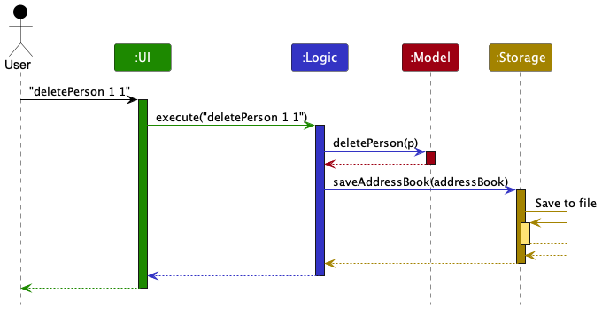
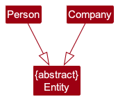
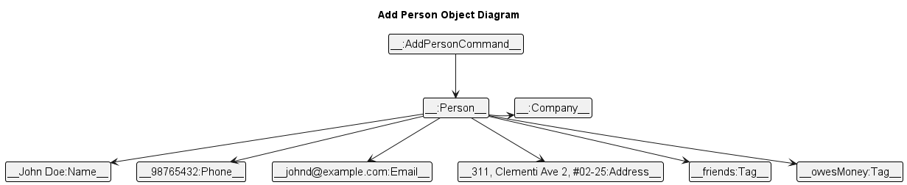

* Table of Contents
{:toc}

--------------------------------------------------------------------------------------------------------------------

## **Acknowledgements**

* {list here sources of all reused/adapted ideas, code, documentation, and third-party libraries -- include links to the original source as well}

--------------------------------------------------------------------------------------------------------------------

## **Setting up, getting started**

Refer to the guide [_Setting up and getting started_](SettingUp.md).

--------------------------------------------------------------------------------------------------------------------

## **Design**

<div markdown="span" class="alert alert-primary">

:bulb: **Tip:** The `.puml` files used to create diagrams in this document `docs/diagrams` folder. Refer to the [_PlantUML Tutorial_ at se-edu/guides](https://se-education.org/guides/tutorials/plantUml.html) to learn how to create and edit diagrams.
</div>

### Architecture


The ***Architecture Diagram*** given above explains the high-level design of the App.

Given below is a quick overview of main components and how they interact with each other.

**Main components of the architecture**

**`Main`** (consisting of classes [`Main`](https://github.com/se-edu/addressbook-level3/tree/master/src/main/java/seedu/address/Main.java) and [`MainApp`](https://github.com/se-edu/addressbook-level3/tree/master/src/main/java/seedu/address/MainApp.java)) is in charge of the app launch and shut down.
* At app launch, it initializes the other components in the correct sequence, and connects them up with each other.
* At shut down, it shuts down the other components and invokes cleanup methods where necessary.

The bulk of the app's work is done by the following four components:

* [**`UI`**](#ui-component): The UI of the App.
* [**`Logic`**](#logic-component): The command executor.
* [**`Model`**](#model-component): Holds the data of the App in memory.
* [**`Storage`**](#storage-component): Reads data from, and writes data to, the hard disk.

[**`Commons`**](#common-classes) represents a collection of classes used by multiple other components.

**How the architecture components interact with each other**

The *Sequence Diagram* below shows how the components interact with each other for the scenario where the user issues the command `delete 1`.



Each of the four main components (also shown in the diagram above),

* defines its *API* in an `interface` with the same name as the Component.
* implements its functionality using a concrete `{Component Name}Manager` class (which follows the corresponding API `interface` mentioned in the previous point.

For example, the `Logic` component defines its API in the `Logic.java` interface and implements its functionality using the `LogicManager.java` class which follows the `Logic` interface. Other components interact with a given component through its interface rather than the concrete class (reason: to prevent outside component's being coupled to the implementation of a component), as illustrated in the (partial) class diagram below.


The sections below give more details of each component.

### UI component

The UI component in this application provides the graphical user interface for interacting with Connectify. It consists of several key classes, including `MainWindow`, `CommandBox`, `ResultDisplay`, `EntityListPanel`, `StatusBarFooter`, `PersonCard` and `CompanyCard`. All these classes, along with `MainWindow`, inherit from the abstract `UiPart` class, which captures the common functionalities between parts of the GUI.

The UI component is built using the JavaFX UI framework, and the layout of UI parts is defined in matching `.fxml` files located in the `src/main/resources/view` folder. For example, the layout of the `MainWindow` is specified in `MainWindow.fxml`.

#### Class Structure

The main classes and their relationships in the UI component are as follows:


The UI consists of the following parts:
- `Ui`: The entry point of the UI component. It orchestrates the various UI elements.
- `MainWindow`: The primary UI window that houses all UI elements.
- `CommandBox`: The input box for user commands.
- `ResultDisplay`: The area that displays command results and system messages.
- `EntityListPanel`: The panel that displays a list of entities (e.g., persons and companies).
- `StatusBarFooter`: The status bar that shows system information.
- `UiPart`: An abstract class that captures common functionalities for UI components. It is inherited by all UI components.

#### Interaction with Other Components

The UI component interacts with other components in the application to fulfill its role:

- **Logic Component**: The UI component executes user commands by delegating them to the Logic component. It relies on the Logic component to process commands and provide responses.

- **Model Component**: The UI component listens for changes to the Model data, specifically the list of persons and companies to display. When the Model data is modified, the UI updates to reflect those changes. It displays information about persons and companies that reside in the Model component.

- **Dependencies**: The UI component has dependencies on various classes within the Model component to display data effectively.

#### Usage

To use the UI component effectively, follow these guidelines:

1. **Starting the UI**: To start the UI, the application initializes the `UiManager`, which is the entry point of the UI. It also creates a `MainWindow` and the associated UI elements.

2. **User Interaction**: Users interact with the UI by entering commands in the `CommandBox`. The UI component processes these commands and displays the results in the `ResultDisplay`.

3. **Display of Entities**: The `EntityListPanel` displays a list of entities. An `Entity` is either a Person or a Company. The `EntityListPanel` displays the entities in a scrollable list. The user can scroll through the list to view all the entities.

4. **Listening for Model Changes**: The UI component actively listens for changes to the Model data. When the Model is updated, the UI reflects these changes, ensuring that the user sees the most current data.

5. **Error Handling**: The UI component handles errors gracefully and provides informative messages to the user when issues occur. These error messages are customised to the specific command the user has provided.

6. **Extending UI Components**: Developers can extend or modify existing UI components by creating new classes that inherit from UiPart. This allows for the addition of new GUI elements and functionality, making it easy to customize and enhance the user interface.

7. **Layout and Styling**: The layout of UI components is defined in matching `.fxml` files located in the `src/main/resources/view` folder. For example, the layout of the `MainWindow` is specified in `MainWindow.fxml`. The styling of UI components is defined in matching `.css` files located in the same folder. For example, the styling of the `MainWindow` is specified in `MainWindow.css`.


#### External Resources

- The API of this component is specified in [`Ui.java`](https://github.com/AY2324S1-CS2103T-T15-4/tp/blob/master/src/main/java/connectify/ui/Ui.java).

- The layouts of UI parts are defined in matching `.fxml` files in the `src/main/resources/view` folder.

- For specific details about the implementation of the `MainWindow`, refer to [`MainWindow.java`](https://github.com/AY2324S1-CS2103T-T15-4/tp/blob/master/src/main/java/connectify/ui/MainWindow.java).


### Logic component

**API** : [`Logic.java`](https://github.com/se-edu/addressbook-level3/tree/master/src/main/java/seedu/address/logic/Logic.java)

Here's a (partial) class diagram of the `Logic` component:


The sequence diagram below illustrates the interactions within the `Logic` component, taking `execute("delete 1")` API call as an example.


<div markdown="span" class="alert alert-info">:information_source: **Note:** The lifeline for `DeleteCommandParser` should end at the destroy marker (X) but due to a limitation of PlantUML, the lifeline reaches the end of diagram.
</div>

How the `Logic` component works:

1. When `Logic` is called upon to execute a command, it is passed to an `AddressBookParser` object which in turn creates a parser that matches the command (e.g., `DeleteCommandParser`) and uses it to parse the command.
1. This results in a `Command` object (more precisely, an object of one of its subclasses e.g., `DeleteCommand`) which is executed by the `LogicManager`.
1. The command can communicate with the `Model` when it is executed (e.g. to delete a person).
1. The result of the command execution is encapsulated as a `CommandResult` object which is returned back from `Logic`.

Here are the other classes in `Logic` (omitted from the class diagram above) that are used for parsing a user command:


How the parsing works:
* When called upon to parse a user command, the `AddressBookParser` class creates an `XYZCommandParser` (`XYZ` is a placeholder for the specific command name e.g., `AddCommandParser`) which uses the other classes shown above to parse the user command and create a `XYZCommand` object (e.g., `AddCommand`) which the `AddressBookParser` returns back as a `Command` object.
* All `XYZCommandParser` classes (e.g., `AddCommandParser`, `DeleteCommandParser`, ...) inherit from the `Parser` interface so that they can be treated similarly where possible e.g, during testing.

### Model component
**API** : [`Model.java`](https://github.com/AY2324S1-CS2103T-T15-4/tp/blob/master/src/main/java/connectify/model/Model.java)


The main entities of Connectify are a `Person` and `Company` which both inherit from the `Entity` class. Such a relationship is to allow either a `Person` or `Company` to be displayed in the UI.
This relationship is modelled in the following diagram:




The `Model` component,

* stores the address book data i.e., all `Person` objects (which are contained in a `UniquePersonList` object) and all `Company` objects (which are contained in a `UniqueCompanyList` object).
* stores the currently 'selected' `Person` objects (e.g., results of a search query) as a separate _filtered_ list which is exposed to outsiders as an unmodifiable `ObservableList<Person>` that can be 'observed' e.g. the UI can be bound to this list so that the UI automatically updates when the data in the list change.
* stores a `UserPref` object that represents the user’s preferences. This is exposed to the outside as a `ReadOnlyUserPref` objects.
* does not depend on any of the other three components (as the `Model` represents data entities of the domain, they should make sense on their own without depending on other components)

<div markdown="span" class="alert alert-info">:information_source: **Note:** An alternative (arguably, a more OOP) model is given below. It has a `Tag` list in the `AddressBook`, which `Person` references. This allows `AddressBook` to only require one `Tag` object per unique tag, instead of each `Person` needing their own `Tag` objects.<br>


</div>


### Storage component

**API** : [`Storage.java`](https://github.com/se-edu/addressbook-level3/tree/master/src/main/java/seedu/address/storage/Storage.java)


The `Storage` component,
* can save both address book data and user preference data in JSON format, and read them back into corresponding objects.
* inherits from both `AddressBookStorage` and `UserPrefStorage`, which means it can be treated as either one (if only the functionality of only one is needed).
* depends on some classes in the `Model` component (because the `Storage` component's job is to save/retrieve objects that belong to the `Model`)

### Common classes

Classes used by multiple components are in the `seedu.addressbook.commons` package.

--------------------------------------------------------------------------------------------------------------------

## **Implementation**

This section describes some noteworthy details on how certain features are implemented.

### List Features `list`/`companies`/`people`

#### Implementation

The mechanism is facilitated by `ListAllCommand`/`ListCompaniesCommand`/`ListPeopleCommand` and `ConnectifyParser` in the `Logic` component, and works as described below.

Upon receiving a valid user input for the list command, `ConnectifyParser` returns a new `ListAllCommand`/`ListCompaniesCommand`/`ListPeopleCommand` object.

The `ListAllCommand` object invokes `updateFilteredPersonList` and `updateFilteredCompanyList` in `ModelManager` in the `Model` component with the predicates `PREDICATE_SHOW_ALL_PERSONS` and `PREDICATE_SHOW_ALL_COMPANIES` to communicate to the Model to display all Companies and Persons. Note that this command does not modify the internal list of Companies and Persons in the Model, only the displayed list.

The `ListCompaniesCommand` object invokes `updateFilteredCompanyList` in `ModelManager` in the `Model` component with the predicates `PREDICATE_SHOW_ALL_COMPANIES` to communicate to the Model to display all Companies. Note that this command does not modify the internal list of Companies in the Model, only the displayed list.

The `ListAllPeopleCommand` object invokes `updateFilteredPersonList` in `ModelManager` in the `Model` component with the predicates `PREDICATE_SHOW_ALL_PERSONS` to communicate to the Model to display all Persons. Note that this command does not modify the internal list of Persons in the Model, only the displayed list.

If the list is empty, `execute` in the list command returns a `CommandResult` with `EMPTY_LIST_MESSAGE` or `MESSAGE_SUCCESS` otherwise.   

The sequence diagram below illustrates the events that take place during the execution of `ListALlCommand`. The other two commands are similar.


### Add Person Feature: `addPerson`

#### Implementation

This feature is facilitated by the `AddPersonCommand` and `AddPersonCommandParser` in the `Logic` component, and works as described below.

When given valid user input, the `AddPersonCommandParser` will create a new `Person` object to add to the address book in the specified company.

Consider a scenario where the user wishes to add a new contact to a specific company with various details. The `AddPersonCommand` takes in various parameters, such as name, phone, email, address, and optional tags, to create a new `Person` object.

To ensure that a contact is added to the correct company, the command also takes an `Index` parameter specifying the company where the contact should be added. This ensures that the contact is associated with the intended company.



Consider an example of a valid `addPerson` command:

```plaintext
addPerson n/John Doe p/98765432 e/johnd@example.com a/311, Clementi Ave 2, #02-25 t/friends t/owesMoney c/1
```

The new objects in the final internal state after this example has been parsed are shown in the object diagram above.

The following activity diagrams detail the behavior of Connectify when a user inputs an addPerson command with valid syntax to be executed.

The AddPersonCommand also handles scenarios where a person with the same details already exists in the address book or the company specified via the company index parameter does not exist. In such cases, the command throws a CommandException with an error message to inform the user.


<div style="page-break-after: always;"></div>

### \[Proposed\] Undo/redo feature

#### Proposed Implementation

The proposed undo/redo mechanism is facilitated by `VersionedAddressBook`. It extends `AddressBook` with an undo/redo history, stored internally as an `addressBookStateList` and `currentStatePointer`. Additionally, it implements the following operations:

* `VersionedAddressBook#commit()` — Saves the current address book state in its history.
* `VersionedAddressBook#undo()` — Restores the previous address book state from its history.
* `VersionedAddressBook#redo()` — Restores a previously undone address book state from its history.

These operations are exposed in the `Model` interface as `Model#commitAddressBook()`, `Model#undoAddressBook()` and `Model#redoAddressBook()` respectively.

Given below is an example usage scenario and how the undo/redo mechanism behaves at each step.

Step 1. The user launches the application for the first time. The `VersionedAddressBook` will be initialized with the initial address book state, and the `currentStatePointer` pointing to that single address book state.


Step 2. The user executes `delete 5` command to delete the 5th person in the address book. The `delete` command calls `Model#commitAddressBook()`, causing the modified state of the address book after the `delete 5` command executes to be saved in the `addressBookStateList`, and the `currentStatePointer` is shifted to the newly inserted address book state.


Step 3. The user executes `add n/David …​` to add a new person. The `add` command also calls `Model#commitAddressBook()`, causing another modified address book state to be saved into the `addressBookStateList`.


<div markdown="span" class="alert alert-info">:information_source: **Note:** If a command fails its execution, it will not call `Model#commitAddressBook()`, so the address book state will not be saved into the `addressBookStateList`.

</div>

Step 4. The user now decides that adding the person was a mistake, and decides to undo that action by executing the `undo` command. The `undo` command will call `Model#undoAddressBook()`, which will shift the `currentStatePointer` once to the left, pointing it to the previous address book state, and restores the address book to that state.


<div markdown="span" class="alert alert-info">:information_source: **Note:** If the `currentStatePointer` is at index 0, pointing to the initial AddressBook state, then there are no previous AddressBook states to restore. The `undo` command uses `Model#canUndoAddressBook()` to check if this is the case. If so, it will return an error to the user rather
than attempting to perform the undo.

</div>

The following sequence diagram shows how the undo operation works:


<div markdown="span" class="alert alert-info">:information_source: **Note:** The lifeline for `UndoCommand` should end at the destroy marker (X) but due to a limitation of PlantUML, the lifeline reaches the end of diagram.

</div>

The `redo` command does the opposite — it calls `Model#redoAddressBook()`, which shifts the `currentStatePointer` once to the right, pointing to the previously undone state, and restores the address book to that state.

<div markdown="span" class="alert alert-info">:information_source: **Note:** If the `currentStatePointer` is at index `addressBookStateList.size() - 1`, pointing to the latest address book state, then there are no undone AddressBook states to restore. The `redo` command uses `Model#canRedoAddressBook()` to check if this is the case. If so, it will return an error to the user rather than attempting to perform the redo.

</div>

Step 5. The user then decides to execute the command `list`. Commands that do not modify the address book, such as `list`, will usually not call `Model#commitAddressBook()`, `Model#undoAddressBook()` or `Model#redoAddressBook()`. Thus, the `addressBookStateList` remains unchanged.


Step 6. The user executes `clear`, which calls `Model#commitAddressBook()`. Since the `currentStatePointer` is not pointing at the end of the `addressBookStateList`, all address book states after the `currentStatePointer` will be purged. Reason: It no longer makes sense to redo the `add n/David …​` command. This is the behavior that most modern desktop applications follow.


The following activity diagram summarizes what happens when a user executes a new command:


#### Design considerations:

**Aspect: How undo & redo executes:**

* **Alternative 1 (current choice):** Saves the entire address book.
  * Pros: Easy to implement.
  * Cons: May have performance issues in terms of memory usage.

* **Alternative 2:** Individual command knows how to undo/redo by
  itself.
  * Pros: Will use less memory (e.g. for `delete`, just save the person being deleted).
  * Cons: We must ensure that the implementation of each individual command are correct.

_{more aspects and alternatives to be added}_

### \[Proposed\] Data archiving

_{Explain here how the data archiving feature will be implemented}_


--------------------------------------------------------------------------------------------------------------------

## **Documentation, logging, testing, configuration, dev-ops**

* [Documentation guide](Documentation.md)
* [Testing guide](Testing.md)
* [Logging guide](Logging.md)
* [Configuration guide](Configuration.md)
* [DevOps guide](DevOps.md)

--------------------------------------------------------------------------------------------------------------------

## **Appendix: Requirements**

### Product scope

**Target user profile**:

* has a need to manage a significant number of contacts
* prefer desktop apps over other types
* can type fast
* prefers typing to mouse interactions
* is reasonably comfortable using CLI apps
* prioritize tools and solutions that streamline their workflow

**Value proposition**: Manage contacts faster than a typical mouse/GUI driven app and offers an efficient solution to manage, categorize, and tag contacts, thus enhancing networking experiences and providing quick access to contact information.

### User stories

Priorities: High (must have) - `* * *`, Medium (nice to have) - `* *`, Low (unlikely to have) - `*`

| Priority | As a …​                                | I want to …​                 | So that I can…​                                                         |
|----------|----------------------------------------|------------------------------|-------------------------------------------------------------------------|
| `* * *`  | new user                               | see usage instructions       | refer to instructions when I forget how to use the App                  |
| `* * *`  | user                                   | add a new contact            |                                                                         |
| `* * *`  | user                                   | add a person to a specific company |  easily identify contacts by their associated company             |
| `* * *`  | user                                   | delete a contact             | remove contacts that I no longer need                                   |
| `* * *`  | user                                   | find a contact by name       | locate details of contacts without having to go through the entire list |
| `* * *`  | user                                   | list all contacts            | know what people and companies I have contacts of                       |
| `* * *`  | user                                   | list all companies           | know what companies I have contacts of                                  |
| `* * *`  | user                                   | list all people              | know who are the people I have contacts with                            |
| `* *`    | user                                   | hide private contact details | minimize chance of someone else seeing them by accident                 |
| `*`      | user with many contacts in Connnectify | sort contacts by name        | locate a contact easily                                                 |

*{More to be added}*

### Use cases

(For all use cases below, the **System** is the `Connectify` and the **Actor** is the `user`, unless specified otherwise)

**Use case: Add a Person**

**MSS**

1. User requests to add a new person.
2. Connectify prompts the user to provide details for the new person, including name, phone, email, address, and company association.
3. User provides the necessary details for the new person.
4. Connectify creates a new person object with the provided details and associates it with the specified company.
5. Connectify updates the address book to include the new person.
6. Connectify confirms the successful addition of the new person.

    Use case ends.

**Extensions**

* 2a. User cancels the operation.

  Use case ends.

* 4a. User provides incomplete or invalid details.

    * 4a1. Connectify shows an error message and prompts the user to provide valid details.

      Use case ends.

* 4b. A person with the same details already exists in the address book.

    * 4b1. Connectify shows an error message indicating that the person already exists.

      Use case ends.

**Use case: Delete a person**

**MSS**

1.  User requests to list persons
2.  Connectify shows a list of contacts
3.  User requests to delete a specific contact in the list
4.  Connectify deletes the contact

    Use case ends.

**Extensions**

* 2a. The list is empty.

  Use case ends.

* 3a. The given index is invalid.

    * 3a1. AddressBook shows an error message.

      Use case resumes at step 2.

**Use case: List all contacts**

**MSS**

1.  User requests to list contacts
2.  Connectify shows a list of contacts

    Use case ends.

**Extensions**

* 2a. The list is empty.

  Use case ends.

* 3a. The given index is invalid.

    * 3a1. Connectify shows an error message.

      Use case resumes at step 2.

**Use case: List all companies**

**MSS**

1.  User requests to list companies
2.  Connectify shows a list of companies

    Use case ends.

**Extensions**

* 2a. The list is empty.

  Use case ends.

* 3a. The given index is invalid.

    * 3a1. Connectify shows an error message.

      Use case resumes at step 2.

**Use case: List all people**

**MSS**

1.  User requests to list people
2.  Connectify shows a list of people

    Use case ends.

**Extensions**

* 2a. The list is empty.

  Use case ends.

* 3a. The given index is invalid.

    * 3a1. Connectify shows an error message.

      Use case resumes at step 2.
*{More to be added}*

### Non-Functional Requirements

1.  Should work on any _mainstream OS_ as long as it has Java `11` or above installed.
2.  Should be able to hold up to 1000 persons without a noticeable sluggishness in performance for typical usage.
3.  A user with above average typing speed for regular English text (i.e. not code, not system admin commands) should be able to accomplish most of the tasks faster using commands than using the mouse.
4.  The application should be highly reliable, with minimal downtime and a low frequency of crashes or failures. It should be able to recover gracefully from unexpected errors and continue functioning without data loss.
5.  The software should be designed with maintainability in mind, allowing for easy updates, bug fixes, and enhancements. This includes well-organized code, clear documentation, and modular architecture.
6.  The Graphical User Interface (GUI) should be intuitive and responsive, and easy to use.

*{More to be added}*

### Glossary

* **Mainstream OS**: Windows, Linux, Unix, OS-X
* **Private contact detail**: A contact detail that is not meant to be shared with others
* **CLI**: Command Line Interface
* **GUI**: Graphical User Interface
* **UI**: User Interface
* **API**: Application Programming Interface
* **MSS**: Main Success Scenario
* **Extension**: Alternative Scenario
* **Actor**: A user or another system that interacts with the system under consideration
* **System**: The software system under consideration

--------------------------------------------------------------------------------------------------------------------

## **Appendix: Instructions for manual testing**

Given below are instructions to test the app manually.

<div markdown="span" class="alert alert-info">:information_source: **Note:** These instructions only provide a starting point for testers to work on;
testers are expected to do more *exploratory* testing.

</div>

### Launch and shutdown

1. Initial launch

   1. Download the jar file and copy into an empty folder

   1. Double-click the jar file Expected: Shows the GUI with a set of sample contacts. The window size may not be optimum.

1. Saving window preferences

   1. Resize the window to an optimum size. Move the window to a different location. Close the window.

   1. Re-launch the app by double-clicking the jar file.<br>
       Expected: The most recent window size and location is retained.

1. _{ more test cases …​ }_

### Deleting a person

1. Deleting a person while all persons are being shown

   1. Prerequisites: List all persons using the `list` command. Multiple persons in the list.

   1. Test case: `delete 1`<br>
      Expected: First contact is deleted from the list. Details of the deleted contact shown in the status message. Timestamp in the status bar is updated.

   1. Test case: `delete 0`<br>
      Expected: No person is deleted. Error details shown in the status message. Status bar remains the same.

   1. Other incorrect delete commands to try: `delete`, `delete x`, `...` (where x is larger than the list size)<br>
      Expected: Similar to previous.

1. _{ more test cases …​ }_

### Saving data

1. Dealing with missing/corrupted data files

   1. _{explain how to simulate a missing/corrupted file, and the expected behavior}_

1. _{ more test cases …​ }_
