# Connectify User Guide

Welcome to Connectify!

Connectify is your all-in-one networking companion, designed specifically to empower **SoC (School of Computing) students** in efficiently managing their connections and enhancing their networking experiences. Whether you're a seasoned professional or just starting your networking journey, Connectify is here to help you build and maintain meaningful connections that can propel your career and personal growth.

Networking is a crucial aspect of your academic and professional life, and Connectify is here to simplify and streamline the process for you. The purpose of this user guide is to **walk you through the key features and functionalities of Connectify**, ensuring you make the most of this powerful networking platform.

### Using this guide
If you are a new user looking to get started with Connectify, our User Guide can help you with [the installation process](#tutorial-installing-connectify), guide you through [adding your first connection to Connectify](#tutorial-adding-your-first-connection), and familiarise you with how to use all of [Connectify’s features](#features).

For a full overview of everything this guide has to offer, do make use of the [Table of Contents](#table-of-contents)!

Finally, here are some of the **symbols** and **text formatting** to look out for as you make use of this guide:

<div markdown="span" class="alert alert-primary"><strong>💡 Tip:</strong>
Blue boxes contain additional information that may be useful for enhancing your experience using Connectify.
</div>

<div markdown="block" class="alert alert-warning"><strong>&#x2757; Caution:</strong>
Yellow boxes contain important warnings.
</div>

|          Text Formatting           | Meaning                                            |
|:----------------------------------:|----------------------------------------------------|
| [Hyperlink to Glossary](#glossary) | Clickable hyperlink to navigate to another section |
|           `command text`           | Text relevant to Connectify user commands          |
|          <kbd>Enter</kbd>          | A keyboard key                                     |

<div style="page-break-after: always;"></div>

--------------------------------------------------------------------------------------------------------------------

## Table of Contents
* [Quick Start](#quick-start)
* [Tutorial: Installing Connectify](#tutorial--installing-connectify)
* [Tutorial: Navigating the application](#tutorial--navigating-the-application)
* [Features](#features)
  * [Components of a Command](#components-of-a-command)
  * [How to Read Command Formats](#how-to-read-command-formats)
  * [General Input Guidelines](#general-input-guidelines)
  * [Features for managing company details](#features-for-managing-company-details)
    * [Adding a company: `addCompany`](#adding-a-company-addcompany)
    * [Deleting a company: `deleteCompany`](#deleting-a-company-deletecompany)
    * [Editing a company: `editCompany`](#editing-a-company-editcompany)
    * [Listing all companies: `companies`](#listing-all-companies-companies)
    * [Adding note to a company: `noteCompany`](#adding-note-to-a-company-notecompany)
    * [Sharing company details: `shareCompany`](#sharing-a-company-details-sharecompany)
  * [Features for managing people contact details](#features-for-managing-people-contact-details)
    * [Adding a person: `addPerson`](#adding-a-person-addperson)
    * [Deleting a person: `deletePerson`](#deleting-a-person-deleteperson)
    * [Editing a person: `editPerson`](#editing-a-person-editperson)
    * [Listing all people: `people`](#listing-all-people-people)
    * [Adding note to a person: `notePerson`](#adding-note-to-a-person-noteperson)
    * [Ranking people by priority: `rank`](#ranking-people-by-priority-rank)
    * [Sharing a person's details: `sharePerson`](#sharing-a-persons-details-shareperson)
  * [General Commands](#general-commands)
    * [Listing all entities: `list`](#listing-all-entities-list)
    * [Clearing the database: `clear`](#clearing-the-database-clear)
    * [Seeking Help: `help`](#seeking-help-help)
    * [Exiting Connectify: `exit`](#exiting-connectify-exit)
  * [Advanced Features](#advanced-features)
    * [Keyboard Shortcuts](#keyboard-shortcuts)
    * [Advanced Data Management Features](#advanced-data-management-features)
* [FAQ](#faq)
* [Known issues](#known-issues)
* [Command Summary](#command-summary)

<div style="page-break-after: always;"></div>

--------------------------------------------------------------------------------------------------------------------

## Quick Start

### Tutorial: Installing Connectify

Getting started with Connectify is extremely simple! Here is a tutorial on how to set up Connectify in **4 easy steps**.

1. Firstly, ensure that you have *Java 11* or above [installed](https://www.baeldung.com/java-check-is-installed) in your Computer.
2. Create a new folder to store Connectify.
3. Download Connectify from following [**this link**](https://github.com/AY2324S1-CS2103T-T15-4/tp/releases) and save the downloaded file in the directory you created in the previous step.
4. Launch Connectify by double-clicking the file in the directory. You'll be greeted by Connectify's primary interface, with an empty database as shown below.

<div markdown="block" class="alert alert-warning"><strong>&#x2757; Caution:</strong>
For MAC users, if an error message popup appears, running 'java -jar connectify.jar' while in the same directory via the MAC command terminal instead will open Connectify.
</div>

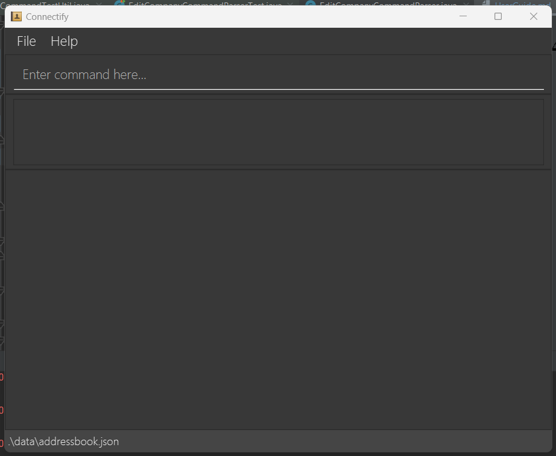

Now that you've successfully installed Connectify, let's take a moment to familiarize ourselves with the application's interface and functionality before diving into its features!

<a href="#table-of-contents" class="return-to-toc-link">
  <span class="return-to-toc-text">Return to Table of Contents</span>
  <span class="return-to-toc-icon">
    <svg xmlns="http://www.w3.org/2000/svg" width="16" height="16" fill="currentColor" class="bi bi-chevron-bar-up" viewBox="0 0 16 16">
      <path fill-rule="evenodd" d="M3.646 11.854a.5.5 0 0 0 .708 0L8 8.207l3.646 3.647a.5.5 0 0 0 .708-.708l-4-4a.5.5 0 0 0-.708 0l-4 4a.5.5 0 0 0 0 .708zM2.4 5.2c0 .22.18.4.4.4h10.4a.4.4 0 0 0 0-.8H2.8a.4.4 0 0 0-.4.4z">
      </path>
    </svg>
  </span>
</a>

<div style="page-break-after: always;"></div>

--------------------------------------------------------------------------------------------------------------------

### Tutorial: Navigating the application

* Connectify uses a [Command Line Interface (CLI)](#glossary-command-line-interface-cli) - which means that you perform actions by entering [commands](#glossary-command) for Connectify to carry out. If you want to find out more on how to make use of commands, you can jump ahead to learn the [components of a command](#components-of-a-command).
* Once a command has been successfully carried out, Connectify will display the results accordingly.
* Refer to the diagrams in the following pages to find out about the different components of Connectify that are responsible for receiving commands, displaying results, and more!

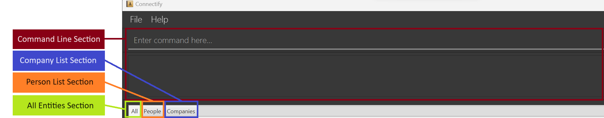

Each section is made of several components which will be explained in the following pages.

#### Command Line Section

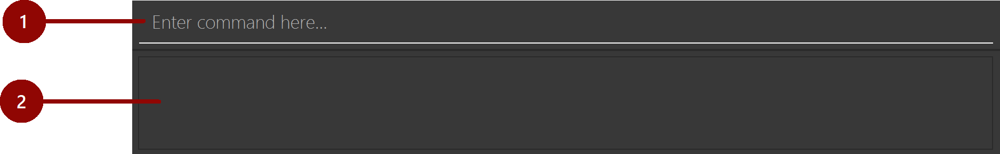

This is the section where you can **enter [commands](#glossary-command)** for Connectify, and where the **messages from Connectify are displayed**.

| Number | Component Name | Details                                                                                                                                                   |
|:------:|----------------|-----------------------------------------------------------------------------------------------------------------------------------------------------------|
|   1.   | Command box    | The box where you enter commands for Connectify to carry out.                                                                                             |
|   2.   | Message box    | The box where a success message will be displayed when Connectify carries out a command successfully, or an error message when Connectify fails to do so. |

<div style="page-break-after: always;"></div>

#### All Entities Section

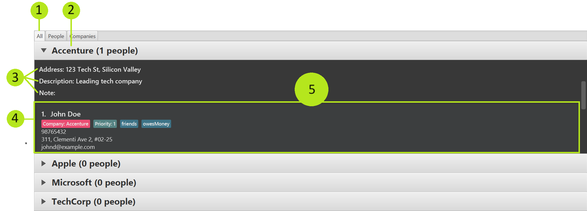

This section contains an overview of **all the entities** added to Connectify. **Click a Company's name** to display the **company details**, as well as the **details of persons under that company**.

| Number | Component Name      | Details                                               |
|:------:|---------------------|-------------------------------------------------------|
|   1.   | "All" Tab           | Click on this tab to view the "All Entities Section". |
|   2.   | Name                | The company's name.                                   |
|   3.   | Company Information | The company’s information.                            |
|   4.   | Person Card         | A box containing the person's details.                |
|   5.   | Company Card        | A box containing the company's details.               |

#### Company List Section

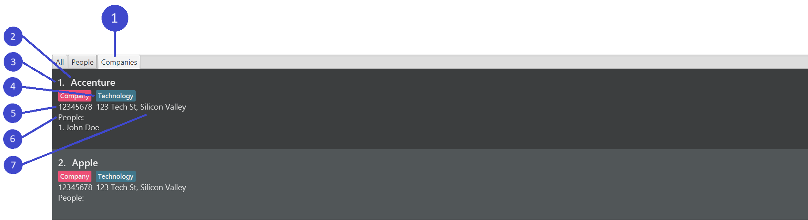

This is the section showing the **list of companies** added to Connectify. Each company contains its **company details**, as well as the **list of persons**.

| Number | Component Name  | Details                                                             |
|:------:|-----------------|---------------------------------------------------------------------|
|   1.   | "Companies" Tab | Click on this tab to view the "Companies Section".                  |
|   2.   | Name            | The company’s name.                                                 |
|   3.   | Company Index   | The index of the company in the company list.                       |
|   4.   | Industry        | The industry the company is in.                                     |
|   5.   | Phone Number    | The company’s phone number.                                         |
|   6.   | List of Persons | A list containing the persons who are associated with that company. |
|   7.   | Address         | The company’s address.                                              |

#### Person List Section


This is the section showing the **list of persons** added to Connectify. Each person contains their **person details**.

| Number | Component Name | Details                                         |
|:------:|----------------|-------------------------------------------------|
|   1.   | "People" Tab   | Click on this tab to view the "People Section". |
|   2.   | Name           | The person’s name.                              |
|   3.   | Person Index   | The index of the person in the person list.     |
|   4.   | Company        | The company the person is working for.          |
|   5.   | Phone Number   | The person’s phone number.                      |
|   6.   | Address        | The person’s address.                           |
|   7.   | Email          | The person's email.                             |
|   8.   | Priority       | The person's priority.                          |
|   9.   | Tags           | The tags attached to the person.                |

<div markdown="block" class="alert alert-warning"><strong>&#x2757; Caution:</strong>
If your provided inputs are too long, Connectify may not be able to fully display them and cut them off! While this is rare, do try to avoid entering unnecessarily long inputs to Connectify (e.g. save a person's nickname rather than their full name).
</div>

<a href="#table-of-contents" class="btn btn-outline-light link-primary" style="border: #f1f2f4 solid 1px !important; border-radius: 5px !important; padding: 5px !important; text-decoration: none !important;"><svg xmlns="http://www.w3.org/2000/svg" width="16" height="16" fill="currentColor" class="bi bi-chevron-bar-up" viewBox="0 0 16 16"><path fill-rule="evenodd" d="M3.646 11.854a.5.5 0 0 0 .708 0L8 8.207l3.646 3.647a.5.5 0 0 0 .708-.708l-4-4a.5.5 0 0 0-.708 0l-4 4a.5.5 0 0 0 0 .708zM2.4 5.2c0 .22.18.4.4.4h10.4a.4.4 0 0 0 0-.8H2.8a.4.4 0 0 0-.4.4z"/></svg> Return to Table of Contents</a>

<div style="page-break-after: always;"></div>

--------------------------------------------------------------------------------------------------------------------

### Tutorial: Adding your first connection

Now that you've familiarized yourself with the Connectify interface, it's time to start connecting with people. This step-by-step guide will walk you through the process of adding your first connection to Connectify in **three simple steps**. You can choose to follow the sample instructions verbatim, or you can get creative and use your details.

The guide begins on the following page!

As a new user, your Connectify database is **empty**. Let's add your first connection!

1. Firstly, you should input a company into your database. The example that we would be using is `addCompany n/Apple Inc i/Technology l/Silicon Valley d/computer and consumer technology w/www.apple.com e/apple@gmail.com p/98765432 a/1 Infinite Loop, Cupertino, California`. This command adds a company named "Apple Inc" to your Connectify database with the relevant details of the company as specified in the command. The output of this command is shown below:

   ```
   New company added: Apple Inc
   Industry: Technology
   Location: Silicon Valley
   Description: computer and consumer technology
   Website: www.apple.com
   Email: apple@gmail.com
   Phone: 98765432
   Address: 1 Infinite Loop, Cupertino, California
   ```

   The company has been successfully added to your Connectify database! You should be able to see the company in your database as shown below:

   

2. Now that you've added a company to your Connectify database, it's time to add a person to your database. The example that we would be using is `addPerson n/John Doe p/98765432 e/johnd@example.com a/311, Clementi Ave 2, #02-25 t/friends t/owesMoney c/1 pr/1`. This command adds a person named "John Doe" to your Connectify database with the relevant details of the person as specified in the command. The output of this command is shown below:

   ```
   New person added: John Doe;
   Phone: 98765432;
   Email: johnd@example.com;
   Address: 311, Clementi Ave 2, #02-25;
   Note: Priority: 1;
   Company: Apple Inc;
   Tags: [owesMoney][friends]
   ```

   The person has been successfully added to your Connectify database! You should be able to see the person in your database as shown below:

    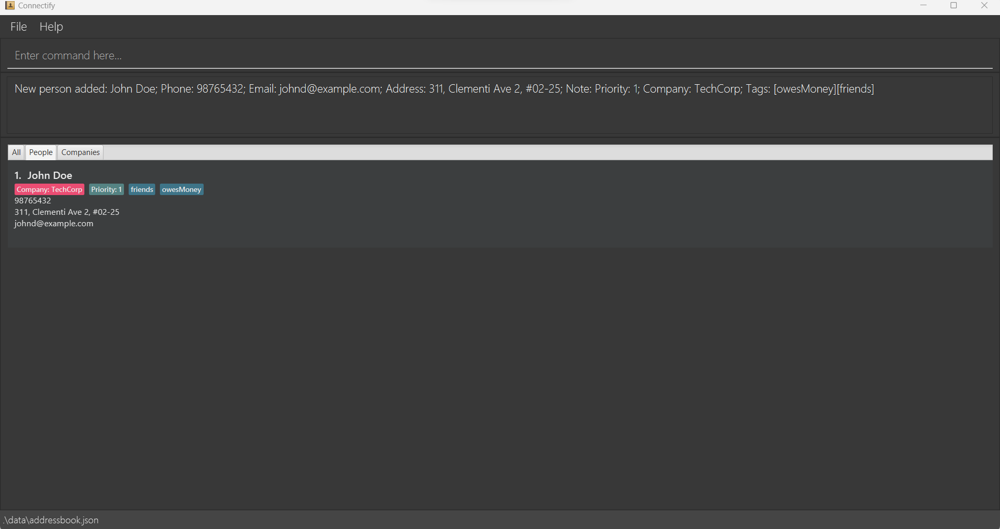

3. Congratulations! You've successfully added your first connection to Connectify. You can now use Connectify to manage your connections and enhance your networking experience. To learn more about the features and functionalities of Connectify, please refer to the [Features](#features) section of this user guide.

<a href="#table-of-contents" class="return-to-toc-link">
  <span class="return-to-toc-text">Return to Table of Contents</span>
  <span class="return-to-toc-icon">
    <svg xmlns="http://www.w3.org/2000/svg" width="16" height="16" fill="currentColor" class="bi bi-chevron-bar-up" viewBox="0 0 16 16">
      <path fill-rule="evenodd" d="M3.646 11.854a.5.5 0 0 0 .708 0L8 8.207l3.646 3.647a.5.5 0 0 0 .708-.708l-4-4a.5.5 0 0 0-.708 0l-4 4a.5.5 0 0 0 0 .708zM2.4 5.2c0 .22.18.4.4.4h10.4a.4.4 0 0 0 0-.8H2.8a.4.4 0 0 0-.4.4z">
      </path>
    </svg>
  </span>
</a>

<div style="page-break-after: always;"></div>

--------------------------------------------------------------------------------------------------------------------

## Features

### Components of a Command

Every command in Connectify is a prompt for action. It's how you command the application to organize your network. Let's understand the different components of a command!

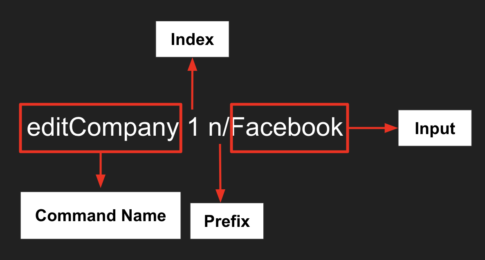

* Command Name<br>
  The **command name** indicates the action you want to perform in Connectify.<br>
  In the example above, `editCompany` is the command name.

* Index<br>
  The **index** is the **numerical position** of an item in a displayed list within Connectify. <br>
  In the example above, `1` represents the first company in the company list.

* Prefixes<br>
  Prefixes ending with a `/` help identify the type of information **you provide** in a command. <br>
  In the example above, `n/`serves as a prefix to indicate that you want to edit a company's name to `Facebook`.

* Inputs<br>
  Inputs are the specific details **you input** for a command to process. <br>
  In the example above, `Facebook` is the input that specifies the new name for the company.

<a href="#table-of-contents" class="return-to-toc-link">
  <span class="return-to-toc-text">Return to Table of Contents</span>
  <span class="return-to-toc-icon">
    <svg xmlns="http://www.w3.org/2000/svg" width="16" height="16" fill="currentColor" class="bi bi-chevron-bar-up" viewBox="0 0 16 16">
      <path fill-rule="evenodd" d="M3.646 11.854a.5.5 0 0 0 .708 0L8 8.207l3.646 3.647a.5.5 0 0 0 .708-.708l-4-4a.5.5 0 0 0-.708 0l-4 4a.5.5 0 0 0 0 .708zM2.4 5.2c0 .22.18.4.4.4h10.4a.4.4 0 0 0 0-.8H2.8a.4.4 0 0 0-.4.4z">
      </path>
    </svg>
  </span>
</a>

<div style="page-break-after: always;"></div>

--------------------------------------------------------------------------------------------------------------------

### How to Read Command Formats

Throughout this user guide, you'll encounter various [General Commands](#general-commands) specific to Connectify. Let's explore how to interpret these command formats.

* Providing User Inputs<br>
  Any words in **capital letters** are **your supplied inputs**.
  For instance, in `editPerson INDEX c/COMPANY`, you can type in `editPerson 1 c/Apple n/Ryan`.

* Optional Inputs<br>
  Inputs enclosed within square brackets `[]` are **optional**.
  For instance, for the command `editPerson INDEX c/COMPANY [n/NAME]`, you can use it in two ways:
  `editPerson INDEX c/COMPANY n/Ryan` or simply as `editPerson INDEX c/COMPANY`.

<a href="#table-of-contents" class="return-to-toc-link">
  <span class="return-to-toc-text">Return to Table of Contents</span>
  <span class="return-to-toc-icon">
    <svg xmlns="http://www.w3.org/2000/svg" width="16" height="16" fill="currentColor" class="bi bi-chevron-bar-up" viewBox="0 0 16 16">
      <path fill-rule="evenodd" d="M3.646 11.854a.5.5 0 0 0 .708 0L8 8.207l3.646 3.647a.5.5 0 0 0 .708-.708l-4-4a.5.5 0 0 0-.708 0l-4 4a.5.5 0 0 0 0 .708zM2.4 5.2c0 .22.18.4.4.4h10.4a.4.4 0 0 0 0-.8H2.8a.4.4 0 0 0-.4.4z">
      </path>
    </svg>
  </span>
</a>

--------------------------------------------------------------------------------------------------------------------

### General Input Guidelines

Here are some guidelines when using any of Connectify's commands. Please follow this to ensure that Connectify understands you!

* Flexible Input Order<br>
  You can key in inputs **that are accompanied by a prefix** in **any order**.<br>
  For example, a command might be structured as `w/WEBSITE e/EMAIL`, but entering `e/EMAIL w/WEBSITE` will work as well.

* Fixed Order for Index Specification<br>
  When specifying an index, **the index must be the first input**.<br>
  For example, `1 n/Apple` is valid, but `n/Apple 1` is not.
  When there are two indexes (PersonIndex and CompanyIndex), **the PersonIndex must come before the CompanyIndex**.<br>
  For example, `1 2 n/Apple` is  referring to the person with index 1 and company with index 2, but `2 1 n/Apple` is referring to the person with index 2 and company with index 1.

<div markdown="block" class="alert alert-warning"><strong>&#x2757; Caution:</strong>
It's important to avoid including inputs that are not expected by a command. For example, if a 'rank' command is designed to accept zero inputs, adding an input like 'p/12345678' might lead to unintended behaviour.
</div>

<a href="#table-of-contents" class="return-to-toc-link">
  <span class="return-to-toc-text">Return to Table of Contents</span>
  <span class="return-to-toc-icon">
    <svg xmlns="http://www.w3.org/2000/svg" width="16" height="16" fill="currentColor" class="bi bi-chevron-bar-up" viewBox="0 0 16 16">
      <path fill-rule="evenodd" d="M3.646 11.854a.5.5 0 0 0 .708 0L8 8.207l3.646 3.647a.5.5 0 0 0 .708-.708l-4-4a.5.5 0 0 0-.708 0l-4 4a.5.5 0 0 0 0 .708zM2.4 5.2c0 .22.18.4.4.4h10.4a.4.4 0 0 0 0-.8H2.8a.4.4 0 0 0-.4.4z">
      </path>
    </svg>
  </span>
</a>

<div style="page-break-after: always;"></div>

--------------------------------------------------------------------------------------------------------------------

### Features for managing company details

#### Adding a company: `addCompany`

The **addCompany** command allows you to add new companies to your Connectify database. To add a company's details, follow the format below:

`addCompany n/NAME i/INDUSTRY l/LOCATION d/DESCRIPTION w/WEBSITE e/EMAIL p/PHONE a/ADDRESS`

The fields are:
- `n/NAME` is the name of the Company.
- `i/INDUSTRY` is the industry the Company is in.
- `l/LOCATION` is the location of the Company.
- `d/DESCRIPTION` is a description of the Company.
- `w/WEBSITE` is the website of the Company.
- `e/EMAIL` is the email address of the Company.
- `p/PHONE` is the phone number of the Company.
- `a/ADDRESS` is the address of the Company.

Note:
- Connectify only supports alphanumeric characters (incl. spaces) for names.
- Connectify only supports alphanumeric characters for tags.
- There are no restrictions on the input for the website field as it is for the user's preference. This means that websites can be successfully inputted even without the `www` prefix.
- All fields are case-sensitive. This means that `Apple Inc` and `apple inc` are considered different names.

**Example:**

To add a Company "Apple Inc", a computer and consumer technology company headquartered in Los Altos, with the website "www.apple.com", email address contact@apple.com, the phone number 98765432, address "1 Apple Park Way, Cupertino, California", use the following command:

```
addCompany n/Apple Inc i/technology l/Los Altos d/computer and consumer technology w/www.apple.com e/contact@apple.com p/98765432 a/1 Apple Park Way, Cupertino, California
```

**Successful Output:**

```
New company added: Apple Inc
Phone: 98765432
Email: contact@apple.com
Address: 1 Apple Park Way, Cupertino, California
Industry: technology
Location: Los Altos
Description: computer and consumer technology
Website: www.apple.com
```

You should be able to see the company in Connectify as shown below:


**Unsuccessful Output:**

- If any of the compulsory placeholders such as `n/`, `i/`, `l/`, `d/`, `w/`, `e/`, `p/` or `a/` are missing, you will receive the following error message:
  ```
  Invalid command format!
  addCompany: Adds a company to the address book. Parameters: n/NAME i/INDUSTRY l/LOCATION d/DESCRIPTION w/WEBSITE e/EMAIL p/PHONE a/ADDRESS
  Example: addCompany n/TechCorp i/Technology l/Silicon Valley d/Leading tech company w/www.techcorp.com e/contact@techcorp.com p/12345678 a/123 Tech St, Silicon Valley
  ```

- If all compulsory placeholders are present but the details are missing, you will receive the following error message:
  ```
  Names should only contain alphanumeric characters and spaces, and it should not be blank
  ```

- If a company with the same name already exists in the address book:
  ```
  This company already exists in the address book.
  ```

<a href="#table-of-contents" class="return-to-toc-link">
  <span class="return-to-toc-text">Return to Table of Contents</span>
  <span class="return-to-toc-icon">
    <svg xmlns="http://www.w3.org/2000/svg" width="16" height="16" fill="currentColor" class="bi bi-chevron-bar-up" viewBox="0 0 16 16">
      <path fill-rule="evenodd" d="M3.646 11.854a.5.5 0 0 0 .708 0L8 8.207l3.646 3.647a.5.5 0 0 0 .708-.708l-4-4a.5.5 0 0 0-.708 0l-4 4a.5.5 0 0 0 0 .708zM2.4 5.2c0 .22.18.4.4.4h10.4a.4.4 0 0 0 0-.8H2.8a.4.4 0 0 0-.4.4z">
      </path>
    </svg>
  </span>
</a>

<div style="page-break-after: always;"></div>

--------------------------------------------------------------------------------------------------------------------

#### Deleting a company: `deleteCompany`

The **deleteCompany** command allows you to remove companies from your Connectify database. To delete a company, follow the command format below:

```
deleteCompany INDEX
```

The fields are:
- `INDEX` is the index of the company you want to delete.

<div markdown="block" class="alert alert-warning"><strong>&#x2757; Caution:</strong>
Be cautious when deleting a company in Connectify. This action is irreversible and will permanently remove all associated data and persons list with the company.
</div>

**Example:**

To delete the company named TechCorp at index 1, use the following command:

```
deleteCompany 1
```

**Successful Output:**

```
Deleted Company: TechCorp;
Industry: Technology;
Location: Silicon Valley;
Description: Leading tech company;
Website: www.techcorp.com;
Email: contact@techcorp.com;
Phone: 12345678;
Address: 123 Tech St, Silicon Valley
```

**Unsuccessful Output:**

- If the specified index is missing or is not a positive integer, you will get the following error message:
```
Invalid command format! 
deleteCompany: Deletes the company identified by the index number used in the displayed company list.
Parameters: INDEX (must be a positive integer)
Example: deleteCompany 1
```

- If the specified index is invalid (larger than the number of companies in the displayed company list), you will get the following error message:
```
The company index provided is invalid.
```

<a href="#table-of-contents" class="return-to-toc-link">
  <span class="return-to-toc-text">Return to Table of Contents</span>
  <span class="return-to-toc-icon">
    <svg xmlns="http://www.w3.org/2000/svg" width="16" height="16" fill="currentColor" class="bi bi-chevron-bar-up" viewBox="0 0 16 16">
      <path fill-rule="evenodd" d="M3.646 11.854a.5.5 0 0 0 .708 0L8 8.207l3.646 3.647a.5.5 0 0 0 .708-.708l-4-4a.5.5 0 0 0-.708 0l-4 4a.5.5 0 0 0 0 .708zM2.4 5.2c0 .22.18.4.4.4h10.4a.4.4 0 0 0 0-.8H2.8a.4.4 0 0 0-.4.4z">
      </path>
    </svg>
  </span>
</a>

<div style="page-break-after: always;"></div>

--------------------------------------------------------------------------------------------------------------------

#### Editing a company: `editCompany`

The **editCompany** command allows you to modify the details of a company in your Connectify database. To edit a company, follow the command format below:

```
editCompany INDEX [n/NAME] [i/INDUSTRY] [l/LOCATION] [d/DESCRIPTION] [w/WEBSITE] [e/EMAIL] [p/PHONE] [a/ADDRESS]
```

The fields are:
- `INDEX` is the index of the company in the displayed company list that you want to edit. It must be a positive integer within the company.
- `[n/NAME]` (optional) is the new name of the company.
- `[i/INDUSTRY]` (optional) is the company's new industry.
- `[l/LOCATION]` (optional) is the company's new location.
- `[d/DESCRIPTION]` (optional) is the company's new description.
- `[w/WEBSITE]` (optional) is the company's new website.
- `[e/EMAIL]` (optional) is the company's new email.
- `[p/PHONE]` (optional) is the company's new phone number.
- `[a/ADDRESS]` (optional) is the company's new address.

Note:
- Connectify only supports alphanumeric characters and spaces for names.
- There are no restrictions on the input for the website field as it is for the user's reference. This means that websites can be successfully inputted even without the `www` prefix.
- All fields are case-sensitive. This means that `Apple Inc` and `apple inc` are considered different names.

**Example:**

To edit the company's name to "TechCorp", their email to techcorp@gmail.com and their address to "123, Jurong West Ave 6, #08-111", use the following command:

```
editCompany 1 n/TechCorp p/91234567 e/techcorp@gmail.com a/123, Jurong West Ave 6, #08-111
```

**Successful Output:**

```
Edited Company: TechCorp;
Industry: Technology;
Location: Silicon Valley;
Description: Leading tech company;
Website: www.techcorp.com;
Email: techcorp@gmail.com;
Phone: 91234567;
Address: 123, Jurong West Ave 6, #08-111;
```

**Unsuccessful Output:**

- If the specified index is missing or is not a positive integer, you will get the following error message:
```
Invalid command format!
editCompany: Edits the details of the company identified by the index number used in the displayed company list. Existing values will be overwritten by the input values.
Parameters: INDEX (must be a positive integer) NAME PHONE EMAIL ADDRESS TAG.
Example: editCompany 1 n/TechCorp p/91234567 e/techcorp@gmail.com a/123, Jurong West Ave 6, #08-111
```

- If you have specified a valid index but don't provide at least one field to edit, you will receive the following error message:
```
At least one field to edit must be provided.
```

- If the specified index is invalid (larger than the number of companies in the displayed company list), you will get the following error message:
```
The company index provided is invalid.
```

<a href="#table-of-contents" class="return-to-toc-link">
  <span class="return-to-toc-text">Return to Table of Contents</span>
  <span class="return-to-toc-icon">
    <svg xmlns="http://www.w3.org/2000/svg" width="16" height="16" fill="currentColor" class="bi bi-chevron-bar-up" viewBox="0 0 16 16">
      <path fill-rule="evenodd" d="M3.646 11.854a.5.5 0 0 0 .708 0L8 8.207l3.646 3.647a.5.5 0 0 0 .708-.708l-4-4a.5.5 0 0 0-.708 0l-4 4a.5.5 0 0 0 0 .708zM2.4 5.2c0 .22.18.4.4.4h10.4a.4.4 0 0 0 0-.8H2.8a.4.4 0 0 0-.4.4z">
      </path>
    </svg>
  </span>
</a>

<div style="page-break-after: always;"></div>

--------------------------------------------------------------------------------------------------------------------

####  Listing all companies: `companies`

The `companies` command allows you to retrieve a list of all companies in Connectify. This command is particularly useful for obtaining an overview of all the companies you have stored. To list all companies, follow the command format below:

```
companies
```

Note:
- This command has no additional fields.
- This command accepts trailing inputs as long as it is separated from the command by a space.

**Successful Output**

```
Listed all companies.
```

You should be able to see all the companies in Connectify as shown below:

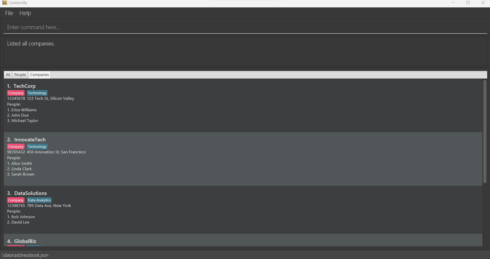

**Unsuccessful Output**

- If Connectify does not contain any companies, and there are no companies to display, you will receive the following message:
```
There are no companies in Connectify.
```

<a href="#table-of-contents" class="return-to-toc-link">
  <span class="return-to-toc-text">Return to Table of Contents</span>
  <span class="return-to-toc-icon">
    <svg xmlns="http://www.w3.org/2000/svg" width="16" height="16" fill="currentColor" class="bi bi-chevron-bar-up" viewBox="0 0 16 16">
      <path fill-rule="evenodd" d="M3.646 11.854a.5.5 0 0 0 .708 0L8 8.207l3.646 3.647a.5.5 0 0 0 .708-.708l-4-4a.5.5 0 0 0-.708 0l-4 4a.5.5 0 0 0 0 .708zM2.4 5.2c0 .22.18.4.4.4h10.4a.4.4 0 0 0 0-.8H2.8a.4.4 0 0 0-.4.4z">
      </path>
    </svg>
  </span>
</a>

<div style="page-break-after: always;"></div>

--------------------------------------------------------------------------------------------------------------------

#### Adding a note to a company: `noteCompany`

The `noteCompany` command allows you to add a note to a company in Connectify. This command is particularly useful for adding notes to companies you have stored. To add a note to a company, follow the command format below:

```
noteCompany INDEX r/NOTE
```

The fields are:
- `INDEX` is the index of the company in the displayed company list that you want to edit. It must be a positive integer within the company.
- `r/NOTE` is the note you want to add to the company.

Note:
- This command deletes the existing note if it is inputted without the `r/` placeholder.
- If the `r/` placeholder is specified twice, the note following the second placeholder will be used.

<div markdown="span" class="alert alert-primary"><strong>💡 Tip:</strong>
Use the <b>noteCompany</b> command in Connectify to add reminders or important details about your interactions with companies.
</div>

**Example:**

To add a note to the company at index 1, use the following command:

```
noteCompany 1 r/Looking for aspiring frontend developers.
```

**Successful Output**

```
Added note to Company: TechCorp;
Industry: Technology;
Location: Silicon Valley;
Description: Leading tech company;
Website: www.techcorp.com;
Email: contact@techcorp.com;
Phone: 12345678;
Address: 123 Tech St, Silicon Valley
```

You should be able to see the note in Connectify as shown below:

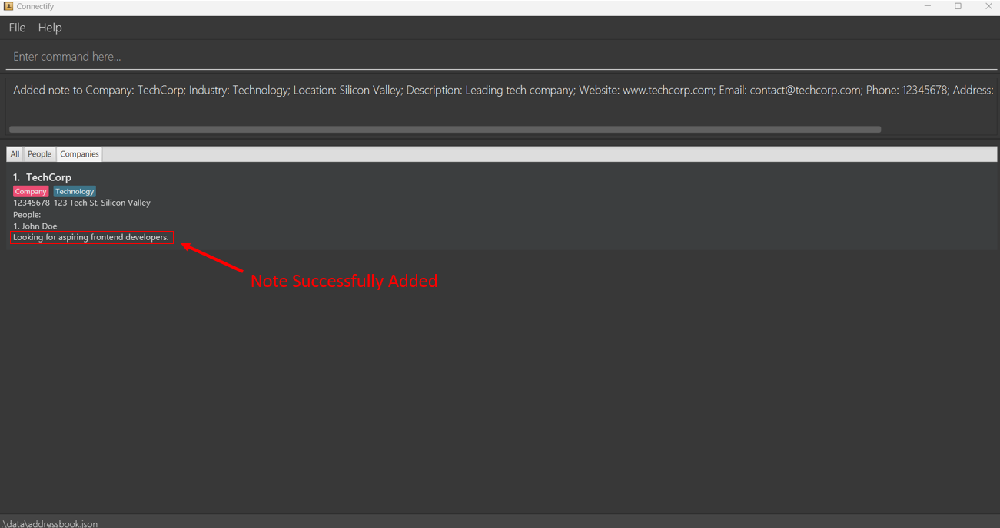

**Unsuccessful Output**

- If the specified index is missing or is not a positive integer, you will get the following error message:
```
Invalid command format!
noteCompany: Edits the note of the company identified by the index number used in the last company listing. Existing note will be overwritten by the input.
Parameters: INDEX (must be a positive integer) r/[NOTE]
Example: noteCompany 1 r/Looking for aspiring frontend developers.
```

- If the specified index is invalid (larger than the number of companies in the displayed company list), you will get the following error message:
```
The company index provided is invalid.
```

<a href="#table-of-contents" class="return-to-toc-link">
  <span class="return-to-toc-text">Return to Table of Contents</span>
  <span class="return-to-toc-icon">
    <svg xmlns="http://www.w3.org/2000/svg" width="16" height="16" fill="currentColor" class="bi bi-chevron-bar-up" viewBox="0 0 16 16">
      <path fill-rule="evenodd" d="M3.646 11.854a.5.5 0 0 0 .708 0L8 8.207l3.646 3.647a.5.5 0 0 0 .708-.708l-4-4a.5.5 0 0 0-.708 0l-4 4a.5.5 0 0 0 0 .708zM2.4 5.2c0 .22.18.4.4.4h10.4a.4.4 0 0 0 0-.8H2.8a.4.4 0 0 0-.4.4z">
      </path>
    </svg>
  </span>
</a>

<div style="page-break-after: always;"></div>

--------------------------------------------------------------------------------------------------------------------

#### Sharing a company details: `shareCompany`

The `shareCompany` command allows you to share a company's details with another person. This command is particularly useful for sharing companies you have stored. Since notes are personal to each user, shareCompany does not include the sharing of notes. To share a company's details, follow the command format below:

```
shareCompany INDEX
```

The fields are:
- `INDEX` is the index of the company in the displayed company list that you want to share. It must be a positive integer within the company.

**Example:**

To share the company at index 1, use the following command:

```
shareCompany 1
```

**Successful Output**

```
Command to add this Company:
addCompany n/TechCorp i/Technology l/Silicon Valley d/Leading tech company w/www.techcorp.com e/contact@techcorp.com p/12345678 a/123 Tech St, Silicon Valley
Do take note that you need to add people on your own.
```

You should see Connectify display the command to be copied, as shown below. The command can be copied and sent to another person, who can then add the company to their Connectify database by pasting the command into the command box and pressing enter.

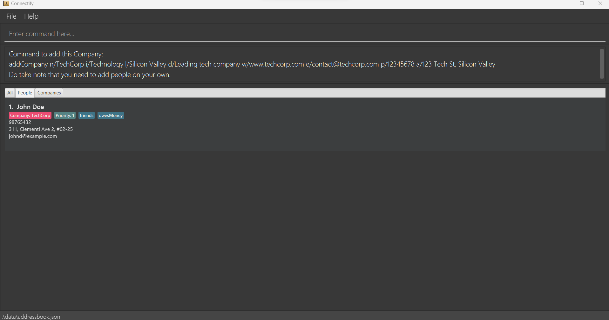

**Unsuccessful Output**

- If the specified index is missing or is not a positive integer, you will get the following error message:
```
Invalid command format!
shareCompany: Shares instructions on how to add a Company to another address book.
Parameters: INDEX (must be a positive integer)
Example: shareCompany 1
```

- If the specified index is invalid (larger than the number of companies in the displayed company list), you will get the following error message:
```
The company index provided is invalid.
```

<a href="#table-of-contents" class="return-to-toc-link">
  <span class="return-to-toc-text">Return to Table of Contents</span>
  <span class="return-to-toc-icon">
    <svg xmlns="http://www.w3.org/2000/svg" width="16" height="16" fill="currentColor" class="bi bi-chevron-bar-up" viewBox="0 0 16 16">
      <path fill-rule="evenodd" d="M3.646 11.854a.5.5 0 0 0 .708 0L8 8.207l3.646 3.647a.5.5 0 0 0 .708-.708l-4-4a.5.5 0 0 0-.708 0l-4 4a.5.5 0 0 0 0 .708zM2.4 5.2c0 .22.18.4.4.4h10.4a.4.4 0 0 0 0-.8H2.8a.4.4 0 0 0-.4.4z">
      </path>
    </svg>
  </span>
</a>

<div style="page-break-after: always;"></div>

--------------------------------------------------------------------------------------------------------------------

### Features for managing people contact details

#### Adding a person: `addPerson`

The `addPerson` command allows you to add new contacts to your Connectify database. Follow the format below to add contacts:

```
addPerson n/NAME p/PHONE e/EMAIL a/ADDRESS pr/PRIORITY [c/COMPANY] [t/TAG]…​
```

The fields are:
- `n/NAME` is the name of the contact.
- `p/PHONE` is the phone number of the contact.
- `e/EMAIL` is the email address of the contact.
- `a/ADDRESS` is the address of the contact.
- `pr/PRIORITY` is the priority level of the contact.
- `[c/COMPANY]` (optional) is the index of the company to which the contact belongs.
- `[t/TAG]…​` (optional) is used to categorize your contacts. Multiple Tags can be added by typing a Tag after each `t/` placeholder. Tags help organize connections efficiently.

Note:
- If the company index is not specified, the contact will be automatically added to the first company in the displayed company list.
- Connectify only supports alphanumeric characters (incl. spaces) for names.
- Connectify only supports alphanumeric characters for tags.
- Connectify does not support the use of `+` or whitespace in phone numbers.
- Each Person is currently restricted to work in one Company.
- All fields are case-sensitive. This means that `John Doe` and `john doe` are considered different names, and `friends` and `Friends` are considered different tags.

**Example:**

To add a contact named John Doe with the phone number 98765432, email address johndoe@example.com, address "311, Clementi Ave 2, #02-25," and associate them with Company 1, use the following command:

```
addPerson n/John Doe p/98765432 e/johndoe@example.com a/311, Clementi Ave 2, #02-25 c/1 t/friends pr/1 t/owesMoney
```

**Successful Output:**

```
New person added: John Doe
Phone: 98765432
Email: johnd@example.com
Address: 311, Clementi Ave 2, #02-25;
Note: ;
Priority: 1;
Company: TechCorp;
Tags: [owesMoney][friends]
```

You should be able to see the person in Connectify as shown below:


**Unsuccessful Output:**

- If any of the compulsory placeholders such as `n/`, `p/`, `e/`, `a/` or `pr/` are missing:
  ```
  Invalid command format!
  addPerson: Adds a person to the address book. Parameters: n/NAME p/PHONE e/EMAIL a/ADDRESS pr/PRIORITY [c/COMPANY_INDEX] [t/TAG]...
  Example: addPerson n/John Doe p/98765432 e/johnd@example.com a/311, Clementi Ave 2, #02-25 t/friends t/owesMoney c/1 pr/1
  ```

- If all the compulsory placeholders are present but the details are missing:
  ```
  Names should only contain alphanumeric characters and spaces, and it should not be blank
  ```

- If a person with the same name already exists in the address book:
  ```
  This person already exists in the address book.
  ```

- If the company index provided is invalid:
  ```
  The company index provided is invalid.
  ```

<a href="#table-of-contents" class="return-to-toc-link">
  <span class="return-to-toc-text">Return to Table of Contents</span>
  <span class="return-to-toc-icon">
    <svg xmlns="http://www.w3.org/2000/svg" width="16" height="16" fill="currentColor" class="bi bi-chevron-bar-up" viewBox="0 0 16 16">
      <path fill-rule="evenodd" d="M3.646 11.854a.5.5 0 0 0 .708 0L8 8.207l3.646 3.647a.5.5 0 0 0 .708-.708l-4-4a.5.5 0 0 0-.708 0l-4 4a.5.5 0 0 0 0 .708zM2.4 5.2c0 .22.18.4.4.4h10.4a.4.4 0 0 0 0-.8H2.8a.4.4 0 0 0-.4.4z">
      </path>
    </svg>
  </span>
</a>

<div style="page-break-after: always;"></div>

--------------------------------------------------------------------------------------------------------------------

#### Deleting a person: `deletePerson`

The **deletePerson** command allows you to remove people from your Connectify database. To delete a person, follow the format below:

```
deletePerson COMPANY_INDEX PERSON_INDEX
```

The fields are:
- `COMPANY_INDEX` is the index of the company that the person is associated with.
- `PERSON_INDEX` is the index of the person you want to delete.

<div markdown="block" class="alert alert-warning"><strong>&#x2757; Caution:</strong>
Deleting a person from Connectify is an irreversible action. Confirm the correct individual is selected before proceeding with this command.
</div>

**Example:**

To delete the person named John Doe at index 1 from the company at index 1, use the following command:

```
deletePerson 1 1
```

**Successful Output:**

```
Deleted Person: Joe Doe;
Phone: 98765432;
Email: johnd@example.com;
Address: 311, Clementi Ave 2, #02-25;
Note: ;
Priority: 1;
Company: ABC;
Tags: [owesMoney][friends]
```

**Unsuccessful Output:**

- If the specified person/company index is missing or is not a positive integer, you will get the following error message:
```
Invalid command format!
deletePerson: Deletes the person identified by the index number from the specified company and also removes them from the address book.
Parameters: COMPANY_INDEX (must be a positive integer) PERSON_INDEX (must be a positive integer)
Example: deletePerson 2 1
```

- If the specified company index is invalid (larger than the number of companies in the displayed company list), you will get the following error message:
```
The company index provided is invalid.
```

- If the specified person index is invalid (larger than the number of people in the displayed person list), you will get the following error message:
```
The person index provided is invalid.
```

- If both the specified company and person index are invalid (larger than the number of companies and people in the displayed company and person list respectively), you will get the following error message:
```
The company index provided is invalid.
```

<a href="#table-of-contents" class="return-to-toc-link">
  <span class="return-to-toc-text">Return to Table of Contents</span>
  <span class="return-to-toc-icon">
    <svg xmlns="http://www.w3.org/2000/svg" width="16" height="16" fill="currentColor" class="bi bi-chevron-bar-up" viewBox="0 0 16 16">
      <path fill-rule="evenodd" d="M3.646 11.854a.5.5 0 0 0 .708 0L8 8.207l3.646 3.647a.5.5 0 0 0 .708-.708l-4-4a.5.5 0 0 0-.708 0l-4 4a.5.5 0 0 0 0 .708zM2.4 5.2c0 .22.18.4.4.4h10.4a.4.4 0 0 0 0-.8H2.8a.4.4 0 0 0-.4.4z">
      </path>
    </svg>
  </span>
</a>

<div style="page-break-after: always;"></div>

--------------------------------------------------------------------------------------------------------------------

####  Editing a person: `editPerson`

The `editPerson` command allows you to modify the details of a person in your Connectify database. To edit contacts, follow the format below:

```
editPerson INDEX c/COMPANY [n/NAME] [p/PHONE] [e/EMAIL] [a/ADDRESS] [pr/PRIORITY] [t/TAG]…​
```

The fields are:
- `INDEX` is the index of the person in the displayed person list of a company that you want to edit. It must be a positive integer within the company.
- `c/COMPANY`is the index of the company that the person is associated with.
- `[n/NAME]` (optional) is the new name of the person.
- `[p/PHONE]` (optional) is the person's new phone number.
- `[e/EMAIL]` (optional) is the person's new email.
- `[a/ADDRESS]` (optional) is the person's new address.
- `[pr/PRIORITY]` (optional) is the person's new priority level.
- `[t/TAG]…​` (optional) is the person's new tags. Multiple Tags can be added by typing a Tag after each `t/` placeholder. Tags help organize connections efficiently.

Note:
- Connectify only supports alphanumeric characters (incl. spaces) for names.
- Connectify only supports alphanumeric characters for tags.
- Connectify does not support the use of `+` or whitespace in phone numbers.
- All fields are case-sensitive. This means that `John Doe` and `john doe` are considered different names, and `friends` and `Friends` are considered different tags.

<div markdown="span" class="alert alert-primary"><strong>💡 Tip:</strong>
Keep contact details up-to-date in Connectify. Be sure the check if they have changed their contact details.
</div>

**Example:**

To edit the person at index 1 in the displayed person list of the Company at index 1 to change their phone number to 91234567 and their email to johndoe@example.com, use the following command:

```
editPerson 1 c/1 p/91234567 e/johndoe@example.com
```

**Successful Output**

```
Edited Person: John Doe;
Phone: 91234567;
Email: johndoe@example.com;
Address: 311, Clementi Ave 2, #02-25;
Note: ;
Priority: 1;
Company: TechCorp;
Tags: [owesMoney][friends]
```

**Unsuccessful Output**

- If you don't provide at least one field to edit, you will receive the following error message:
```
At least one field to edit must be provided.
```

- If the specified index is missing or is not a positive integer, you will get the following error message:
```
Invalid command format!
editPerson: Edits the details of the person identified by the index number used in the displayed person list. Existing values will be overwritten by the input values.
Parameters: INDEX (must be a positive integer within the company) [c/COMPANY] [n/NAME] [p/PHONE] [e/EMAIL] [a/ADDRESS] [r/NOTE] [pr/PRIORITY] [t/TAG].
Example: editPerson 1 c/1 p/91234567 e/johndoe@example.com
```

- If the specified person index is invalid (larger than the number of people in the displayed person list within the company), you will get the following error message:
```
The person index provided is invalid.
```

- If the specified company index is 0 or a negative number, you will get the following error message:
```
Index is not a non-zero unsigned integer.
```

- If the specified company index is missing, you will get the following error message:
```
No company provided.
```

- If you try to edit a person's details to match another person in the address book, you will receive the following error message:
```
This person already exists in the Connectify.
```

<a href="#table-of-contents" class="return-to-toc-link">
  <span class="return-to-toc-text">Return to Table of Contents</span>
  <span class="return-to-toc-icon">
    <svg xmlns="http://www.w3.org/2000/svg" width="16" height="16" fill="currentColor" class="bi bi-chevron-bar-up" viewBox="0 0 16 16">
      <path fill-rule="evenodd" d="M3.646 11.854a.5.5 0 0 0 .708 0L8 8.207l3.646 3.647a.5.5 0 0 0 .708-.708l-4-4a.5.5 0 0 0-.708 0l-4 4a.5.5 0 0 0 0 .708zM2.4 5.2c0 .22.18.4.4.4h10.4a.4.4 0 0 0 0-.8H2.8a.4.4 0 0 0-.4.4z">
      </path>
    </svg>
  </span>
</a>

<div style="page-break-after: always;"></div>

--------------------------------------------------------------------------------------------------------------------

####  Listing all people: `people`

The `people` command allows you to retrieve a list of all individuals (persons) in the Connectify. This command is especially useful for obtaining an overview of all the individuals you have stored. To list all people, follow the command format below:

```
people
```

Note:
- This command has no additional fields.
- This command accepts trailing inputs as long as it is separated from the command by a space.

**Successful Output**

```
Listed all persons.
```

You should be able to see all the people in Connectify as shown below:

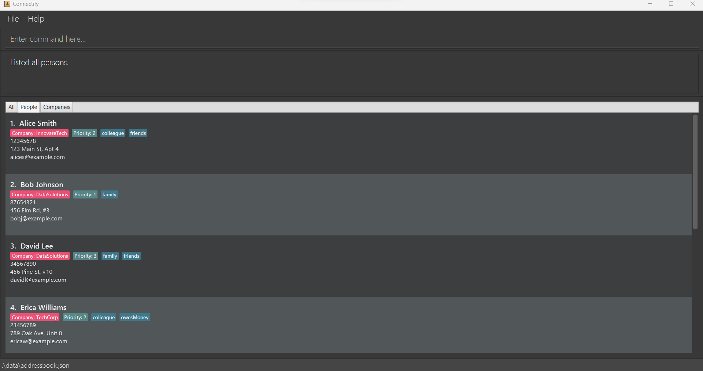

**Unsuccessful Output**

- If Connectify does not contain any individuals (persons), and there are no people to list, you will receive the following message:
```
There are no people in Connectify.
```

<a href="#table-of-contents" class="return-to-toc-link">
  <span class="return-to-toc-text">Return to Table of Contents</span>
  <span class="return-to-toc-icon">
    <svg xmlns="http://www.w3.org/2000/svg" width="16" height="16" fill="currentColor" class="bi bi-chevron-bar-up" viewBox="0 0 16 16">
      <path fill-rule="evenodd" d="M3.646 11.854a.5.5 0 0 0 .708 0L8 8.207l3.646 3.647a.5.5 0 0 0 .708-.708l-4-4a.5.5 0 0 0-.708 0l-4 4a.5.5 0 0 0 0 .708zM2.4 5.2c0 .22.18.4.4.4h10.4a.4.4 0 0 0 0-.8H2.8a.4.4 0 0 0-.4.4z">
      </path>
    </svg>
  </span>
</a>

<div style="page-break-after: always;"></div>

--------------------------------------------------------------------------------------------------------------------

#### Adding note to a person: `notePerson`

The `notePerson` command allows you to add a note to a person in Connectify. This command is particularly useful for adding notes to people you have stored. To add a note to a person, follow the command format below:

```
notePerson COMPANY_INDEX PERSON_INDEX r/NOTE
```

The fields are:
- `COMPANY_INDEX` is the index of the company that the person is associated with.
- `PERSON_INDEX` is the index of the person in the displayed person list of a company that you want to edit. It must be a positive integer within the company.
- `r/NOTE` is the note you want to add to the person.

Note:
- This command deletes the existing note if it is inputted without the `r/` placeholder.
- If the `r/` placeholder is specified twice, the note following the second placeholder will be used.

<div markdown="span" class="alert alert-primary"><strong>💡 Tip:</strong>
Use notes in Connectify to record key information about your interactions or important dates related to each contact.
</div>

**Example:**

To add a note to the person at index 1 in the displayed person list of Company 1, use the following command:

```
notePerson 1 1 r/Likes to swim.
```

**Successful Output**

```
Added note to Person: John Doe;
Phone: 98765432;
Email: johnd@example.com;
Address: 311, Clementi Ave 2, #02-25;
Note:
Likes to swim.;
Priority: 1;
Company: TechCorp;
Tags: [owesMoney][friends]
```

You should be able to see the note in Connectify as shown below:

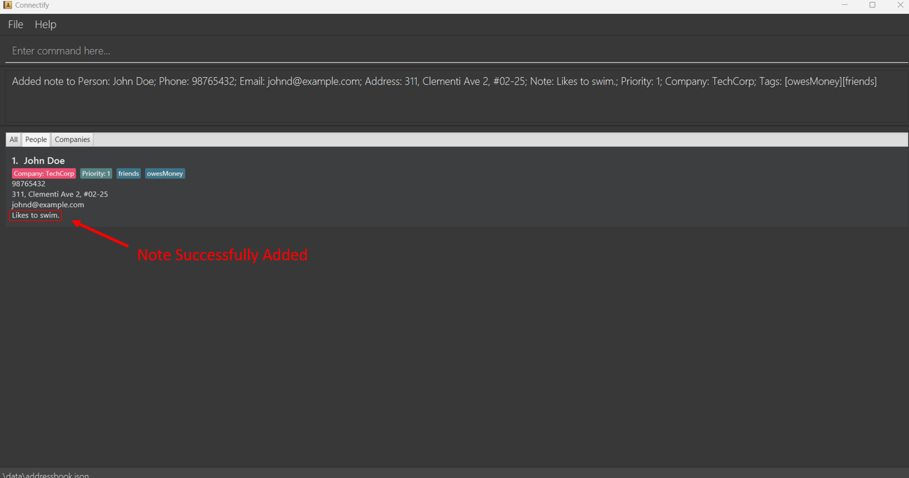

**Unsuccessful Output**

- If the specified company/person index is missing or not a positive integer, you will get the following error message:
```
Invalid command format! 
notePerson: Changes the note of the person identified by the index number used in the displayed person list. Existing note will be overwritten by the input.
Parameters: COMPANY_INDEX PERSON_INDEX (must be a positive integer) [r/NOTE]
```

- If the specified company index is invalid (larger than the number of companies in the displayed company list), you will get the following error message:
```
The company index provided is invalid.
```

- If the specified person index is invalid (larger than the number of companies in the displayed person list), you will get the following error message:
```
The person index provided is invalid.
```

<a href="#table-of-contents" class="return-to-toc-link">
  <span class="return-to-toc-text">Return to Table of Contents</span>
  <span class="return-to-toc-icon">
    <svg xmlns="http://www.w3.org/2000/svg" width="16" height="16" fill="currentColor" class="bi bi-chevron-bar-up" viewBox="0 0 16 16">
      <path fill-rule="evenodd" d="M3.646 11.854a.5.5 0 0 0 .708 0L8 8.207l3.646 3.647a.5.5 0 0 0 .708-.708l-4-4a.5.5 0 0 0-.708 0l-4 4a.5.5 0 0 0 0 .708zM2.4 5.2c0 .22.18.4.4.4h10.4a.4.4 0 0 0 0-.8H2.8a.4.4 0 0 0-.4.4z">
      </path>
    </svg>
  </span>
</a>

<div style="page-break-after: always;"></div>

--------------------------------------------------------------------------------------------------------------------

#### Ranking people by priority: `rank`

The `rank` command allows you to rank people by priority in Connectify. This command is particularly useful for ranking people you have stored. Since higher priority indicates higher value, rank will sort the people in descending order, with the highest priority displayed at the top. To rank people by priority, follow the command format below:

```
rank
```

Note:
- This command has no additional fields.
- This command accepts trailing inputs as long as it is separated from the command by a space.
- This command ranks people by decreasing numerical values of priority. Hence, a person with priority 10 will be ranked higher (closer to the top of the list) than a person with priority 1.

<div markdown="span" class="alert alert-primary"><strong>💡 Tip:</strong>
Use the `rank` command in Connectify to prioritise your contacts based on current professional needs or project requirements.
</div>

**Successful Output**

```
Ranked all persons
```

You should be able to see the following in Connectify as shown below:

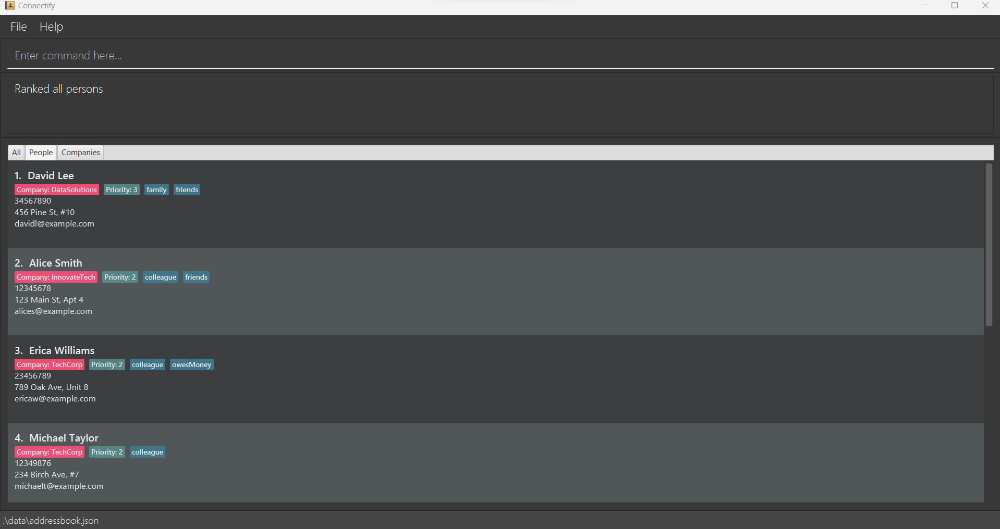

**Unsuccessful Output**

- If Connectify does not contain any individuals (persons), and there are no people to rank, you will receive the following message:
```
There are no people in Connectify.
```

<a href="#table-of-contents" class="return-to-toc-link">
  <span class="return-to-toc-text">Return to Table of Contents</span>
  <span class="return-to-toc-icon">
    <svg xmlns="http://www.w3.org/2000/svg" width="16" height="16" fill="currentColor" class="bi bi-chevron-bar-up" viewBox="0 0 16 16">
      <path fill-rule="evenodd" d="M3.646 11.854a.5.5 0 0 0 .708 0L8 8.207l3.646 3.647a.5.5 0 0 0 .708-.708l-4-4a.5.5 0 0 0-.708 0l-4 4a.5.5 0 0 0 0 .708zM2.4 5.2c0 .22.18.4.4.4h10.4a.4.4 0 0 0 0-.8H2.8a.4.4 0 0 0-.4.4z">
      </path>
    </svg>
  </span>
</a>

<div style="page-break-after: always;"></div>

--------------------------------------------------------------------------------------------------------------------

#### Sharing a person's contact details: `sharePerson`

The `sharePerson` command allows you to share a person's contact details with another person. This command is particularly useful for sharing contact details of people you have stored. To share a person's contact details, follow the command format below:

```
sharePerson COMPANY_INDEX PERSON_INDEX
```

The fields are:
- `COMPANY_INDEX` is the index of the company that the person is associated with.
- `PERSON_INDEX` is the index of the person in the displayed person list of a company that you want to share. It must be a positive integer within the company.

<div markdown="block" class="alert alert-warning"><strong>&#x2757; Caution:</strong>
Be cautious about sharing personal contact details through Connectify. Always respect privacy and share contact information only with consent.
</div>

**Example:**

To share the contact details of the person at index 1 in the displayed person list of Company 1, use the following command:

```
sharePerson 1 1
```

**Successful Output**

```
Command to add this Person:
addPerson n/John Doe p/98765432 e/johnd@example.com a/311, Clementi Ave 2, #02-25 n/Priority t/owesMoney t/friends
Do take note that you need to specify Company and priority on your own.
```

You should see Connectify display the command to be copied, as shown below. The command can be copied and sent to another person, who can then add the company to their Connectify database by pasting the command into the command box and pressing enter.

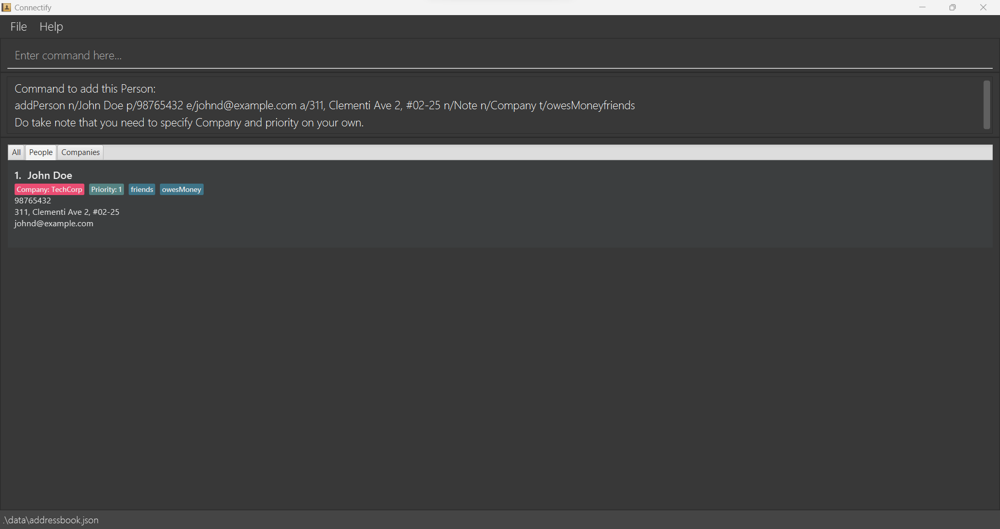

**Unsuccessful Output**

- If the specified company/person index is missing or is not a positive integer, you will get the following error message:
```
Invalid command format!
sharePerson: Shares instructions on how to add a Person, from the specified company, to another address book.
Parameters: COMPANY_INDEX (must be a positive integer) PERSON_INDEX (must be a positive integer)
```

- If the specified company index is invalid (larger than the number of companies in the displayed company list), you will get the following error message:
```
The company index provided is invalid.
```

- If the specified person index is invalid (larger than the number of companies in the displayed person list), you will get the following error message:
```
The person index provided is invalid.
```

<a href="#table-of-contents" class="return-to-toc-link">
  <span class="return-to-toc-text">Return to Table of Contents</span>
  <span class="return-to-toc-icon">
    <svg xmlns="http://www.w3.org/2000/svg" width="16" height="16" fill="currentColor" class="bi bi-chevron-bar-up" viewBox="0 0 16 16">
      <path fill-rule="evenodd" d="M3.646 11.854a.5.5 0 0 0 .708 0L8 8.207l3.646 3.647a.5.5 0 0 0 .708-.708l-4-4a.5.5 0 0 0-.708 0l-4 4a.5.5 0 0 0 0 .708zM2.4 5.2c0 .22.18.4.4.4h10.4a.4.4 0 0 0 0-.8H2.8a.4.4 0 0 0-.4.4z">
      </path>
    </svg>
  </span>
</a>

<div style="page-break-after: always;"></div>

--------------------------------------------------------------------------------------------------------------------

### General Commands

####  Listing all entities: `list`

The `list` command allows you to retrieve a list of all entities (both persons and companies) in the Connectify database. This command is useful for obtaining an overview of all the entities you have stored.

Follow the format below to list all entities:

```
list
```

Note:
- This command has no additional fields.
- This command accepts trailing inputs as long as it is separated from the command by a space.

**Successful Output**

```
Listed all persons and companies.
```

You should be able to see all your connections in Connectify as shown below:


**Unsuccessful Output**

- If Connectify is empty, and there are no entities to display, you will receive the following message:
```
There are no entities in Connectify.
```

<a href="#table-of-contents" class="return-to-toc-link">
  <span class="return-to-toc-text">Return to Table of Contents</span>
  <span class="return-to-toc-icon">
    <svg xmlns="http://www.w3.org/2000/svg" width="16" height="16" fill="currentColor" class="bi bi-chevron-bar-up" viewBox="0 0 16 16">
      <path fill-rule="evenodd" d="M3.646 11.854a.5.5 0 0 0 .708 0L8 8.207l3.646 3.647a.5.5 0 0 0 .708-.708l-4-4a.5.5 0 0 0-.708 0l-4 4a.5.5 0 0 0 0 .708zM2.4 5.2c0 .22.18.4.4.4h10.4a.4.4 0 0 0 0-.8H2.8a.4.4 0 0 0-.4.4z">
      </path>
    </svg>
  </span>
</a>

<div style="page-break-after: always;"></div>

--------------------------------------------------------------------------------------------------------------------

#### Clearing the database: `clear`

The `clear` command allows you to clear all entities (both persons and companies) in the Connectify database. This command is useful for clearing all the entities you have stored. The command format is as follows:

```
clear
```

Note:
- This command has no additional fields.
- This command accepts trailing inputs as long as it is separated from the command by a space.

**Successful Output**

```
Cleared all persons and companies.
```

<div markdown="block" class="alert alert-warning"><strong>&#x2757; Caution:</strong>
Do take note that this `clear` action is irreversible. Your company and people lists will be deleted.
</div>

<a href="#table-of-contents" class="return-to-toc-link">
  <span class="return-to-toc-text">Return to Table of Contents</span>
  <span class="return-to-toc-icon">
    <svg xmlns="http://www.w3.org/2000/svg" width="16" height="16" fill="currentColor" class="bi bi-chevron-bar-up" viewBox="0 0 16 16">
      <path fill-rule="evenodd" d="M3.646 11.854a.5.5 0 0 0 .708 0L8 8.207l3.646 3.647a.5.5 0 0 0 .708-.708l-4-4a.5.5 0 0 0-.708 0l-4 4a.5.5 0 0 0 0 .708zM2.4 5.2c0 .22.18.4.4.4h10.4a.4.4 0 0 0 0-.8H2.8a.4.4 0 0 0-.4.4z">
      </path>
    </svg>
  </span>
</a>

<div style="page-break-after: always;"></div>

--------------------------------------------------------------------------------------------------------------------

#### Seeking Help: `help`

The `help` command displays a link to this user guide. This command is useful for obtaining an overview of all the commands available in Connectify for you. The command format is as follows:

```
help
```

Note:
- This command has no additional fields.
- This command accepts trailing inputs as long as it is separated from the command by a space.

**Successful Output**
```
Opened help window.
```

Additionally, a pop-up window will appear with the link to this user guide as shown below:

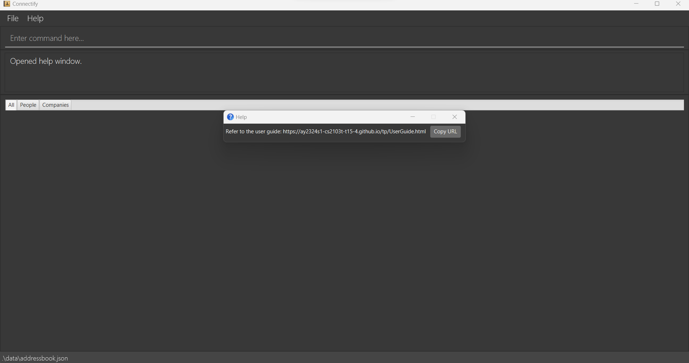

<a href="#table-of-contents" class="return-to-toc-link">
  <span class="return-to-toc-text">Return to Table of Contents</span>
  <span class="return-to-toc-icon">
    <svg xmlns="http://www.w3.org/2000/svg" width="16" height="16" fill="currentColor" class="bi bi-chevron-bar-up" viewBox="0 0 16 16">
      <path fill-rule="evenodd" d="M3.646 11.854a.5.5 0 0 0 .708 0L8 8.207l3.646 3.647a.5.5 0 0 0 .708-.708l-4-4a.5.5 0 0 0-.708 0l-4 4a.5.5 0 0 0 0 .708zM2.4 5.2c0 .22.18.4.4.4h10.4a.4.4 0 0 0 0-.8H2.8a.4.4 0 0 0-.4.4z">
      </path>
    </svg>
  </span>
</a>

<div style="page-break-after: always;"></div>

--------------------------------------------------------------------------------------------------------------------

#### Exiting Connectify: `exit`

This command exits the program.

```
exit
```

Note:
- This command has no additional fields.
- This command accepts trailing inputs as long as it is separated from the command by a space.

**Successful Output:**

There will be no output. The program will exit and the application window will close.

**Unsuccessful Output:**
- If the command is spelt wrongly, you will get the following error message:
```
That is not a valid command.
```

<a href="#table-of-contents" class="return-to-toc-link">
  <span class="return-to-toc-text">Return to Table of Contents</span>
  <span class="return-to-toc-icon">
    <svg xmlns="http://www.w3.org/2000/svg" width="16" height="16" fill="currentColor" class="bi bi-chevron-bar-up" viewBox="0 0 16 16">
      <path fill-rule="evenodd" d="M3.646 11.854a.5.5 0 0 0 .708 0L8 8.207l3.646 3.647a.5.5 0 0 0 .708-.708l-4-4a.5.5 0 0 0-.708 0l-4 4a.5.5 0 0 0 0 .708zM2.4 5.2c0 .22.18.4.4.4h10.4a.4.4 0 0 0 0-.8H2.8a.4.4 0 0 0-.4.4z">
      </path>
    </svg>
  </span>
</a>

<div style="page-break-after: always;"></div>

--------------------------------------------------------------------------------------------------------------------

## Advanced Features

Note that the information in this section is **optional**.

This section is meant for more advanced users of Connectify who are already familiar with the basic functionality and features and who are looking to increase their efficiency further when using Connectify. If you are still getting used to the features, don't worry about the content in this section yet. You can always revisit this section when you are more comfortable using Connectify.

### Keyboard shortcuts

While you can use a mouse to navigate Connectify, using the keyboard can be a great way to improve your efficiency and productivity as you can **reduce time wasted** switching frequently between your keyboard and mouse.

The table on the next page lists the keyboard shortcuts currently available in Connectify. You can refer to the [Tutorial: Navigating the Application](#tutorial--navigating-the-application) section to familiarise yourself with the components of Connectify that are used in this section.

<div style="page-break-after: always;"></div>

|                  Keyboard Key                  | Function                                                                                                                                                                                                                                                                                                                                                                                                                                                                                                                   |
|:----------------------------------------------:|----------------------------------------------------------------------------------------------------------------------------------------------------------------------------------------------------------------------------------------------------------------------------------------------------------------------------------------------------------------------------------------------------------------------------------------------------------------------------------------------------------------------------|
|                 <kbd>F1</kbd>                  | **Seeking help:**<br> At anytime, press <kbd>F1</kbd> to bring up the pop-up window with the link to the user guide.                                                                                                                                                                                                                                                                                                                                                                                                       |
|                 <kbd>Tab</kbd>                 | **Scrolling down the section:**<br> When you are in the Command box, press <kbd>Tab</kbd> twice to navigate to the "All" Tab. If you wish to navigate to the "People" Tab or 'Companies' Tab, please refer to the section on the <kbd>LeftArrow</kbd> and <kbd>RightArrow</kbd> keyboard shortcuts. Once you are at the Tab of any of the three sections, use <kbd>Tab</kbd> to continue moving down that section. Pressing <kbd>Tab</kbd> again after reaching the end of the section will return you to the Command box. |
|       <kbd>Shift</kbd> + <kbd>Tab</kbd>        | **Scrolling up the section:**<br> Similar to <kbd>Tab</kbd> but moves up the section instead.                                                                                                                                                                                                                                                                                                                                                                                                                              |
| <kbd>LeftArrow</kbd> and <kbd>RightArrow</kbd> | **Switching to another section:**<br> When you are at any of the three Tabs, press <kbd>LeftArrow</kbd> to navigate to the Tab directly to the current Tab's left. If you are currently at the "All" Tab, pressing <kbd>LeftArrow</kbd> wil navigate you to the "Companies" Tab. Press <kbd>RightArrow</kbd> to navigate to the Tab directly to the current Tab's right. If you are currently at the "Companies" Tab, pressing <kbd>RightArrow</kbd> wil navigate you to the "All" Tab.                                    |
|                <kbd>Space</kbd>                | **Navigating a Company Card in the All Entities Section:**<br> When you are at any Company Card in the All Entities Section, use <kbd>Space</kbd> to expand or close the Company Card you are currently on.                                                                                                                                                                                                                                                                                                                |
|  <kbd>UpArrow</kbd> and <kbd>DownArrow</kbd>   | **Switching to another Person card or Company card:**<br> When you are in the Person List Section or Company List Section, press <kbd>UpArrow</kbd> or <kbd>DownArrow</kbd> to move up or down the section.                                                                                                                                                                                                                                                                                                                |

<a href="#table-of-contents" class="return-to-toc-link">
  <span class="return-to-toc-text">Return to Table of Contents</span>
  <span class="return-to-toc-icon">
    <svg xmlns="http://www.w3.org/2000/svg" width="16" height="16" fill="currentColor" class="bi bi-chevron-bar-up" viewBox="0 0 16 16">
      <path fill-rule="evenodd" d="M3.646 11.854a.5.5 0 0 0 .708 0L8 8.207l3.646 3.647a.5.5 0 0 0 .708-.708l-4-4a.5.5 0 0 0-.708 0l-4 4a.5.5 0 0 0 0 .708zM2.4 5.2c0 .22.18.4.4.4h10.4a.4.4 0 0 0 0-.8H2.8a.4.4 0 0 0-.4.4z">
      </path>
    </svg>
  </span>
</a>

<div style="page-break-after: always;"></div>

--------------------------------------------------------------------------------------------------------------------

### Advanced Data Management Features

#### Saving your data

Connectify will automatically save your data on your hard disk after any command that changes it. There is no need for you to manually save your data.

#### Editing your data file

You can directly modify Connectify's data without opening the application. You can do so by editing the Connectify [JSON file](https://fileinfo.com/extension/json) `[JAR file location]/data/addressbook.json`.

<div markdown="block" class="alert alert-warning"><strong>&#x2757; Caution:</strong>
If your edited data is not of the correct format, Connectify will <b>be unable to read your data</b> and start with an empty JSON file the next time you launch Connectify.
</div>

<a href="#table-of-contents" class="return-to-toc-link">
  <span class="return-to-toc-text">Return to Table of Contents</span>
  <span class="return-to-toc-icon">
    <svg xmlns="http://www.w3.org/2000/svg" width="16" height="16" fill="currentColor" class="bi bi-chevron-bar-up" viewBox="0 0 16 16">
      <path fill-rule="evenodd" d="M3.646 11.854a.5.5 0 0 0 .708 0L8 8.207l3.646 3.647a.5.5 0 0 0 .708-.708l-4-4a.5.5 0 0 0-.708 0l-4 4a.5.5 0 0 0 0 .708zM2.4 5.2c0 .22.18.4.4.4h10.4a.4.4 0 0 0 0-.8H2.8a.4.4 0 0 0-.4.4z">
      </path>
    </svg>
  </span>
</a>

<div style="page-break-after: always;"></div>

--------------------------------------------------------------------------------------------------------------------

## FAQ

**Q1: How do I navigate around Connectify's UI?**

A: Connectify's UI consists of 3 tabs. The first tab shows a detailed view of all companies and their associated person. The person tab shows a detailed view of each person and the company that they belong to. The companies tab shows a view of the various companies within Connectify. Since this companies tab aims to only show a simplified view, each company card only shows the basic fields such as name, phone, address, tags and people. The note section comes below the people list. For a more detailed view of each company, you can click on the company card to view the company's details in the first tab.

**Q2: What is considered a duplicate in Connectify?**

A: In Connectify, companies and people are considered duplicates if they share the same name as an existing company or person. Note that this condition holds for names that have the same letters but different cases. For example, `John` is considered different from `john`.

**Q3: Why are my fields being cut off in the UI?**

A: Do note that Connectify's UI does not fully support long fields and will cut off fields that are too long. However, the supported length is likely sufficient for most fields.

**Q4: What sort of input is not allowed in Connectify?**

A: Connectify does not impose strict input validation on the fields of companies and people, other than basic ones such as Names needing to be alphanumeric, not blank, and case-sensitive unique, while phone numbers must be numeric. Stricter input validation will be implemented in future versions of Connectify.

**Q5: What if one of my contacts belongs to multiple companies?**

A: Connectify does not support the same person being associated with multiple companies at our current version. This is to avoid confusion when sharing contacts with others. However, we are looking to implement this feature in future versions of Connectify.

**Q6: Should a person of higher priority be assigned a higher or lower priority number?**

A: A person of a higher priority should be assigned a higher priority number. This is because Connectify's `rank` command ranks people by decreasing numerical values of priority. Hence, a person with priority 10 will be ranked higher (closer to the top of the list) than a person with priority 1. The numerical range for the priority field is 1 to 10.

**Q7: What is the numerical range for the priority field?**

A: Connectify does not restrict the upper boundary of the numerical range for the priority field. This is so that a person who has ranked contacts of the highest priority at point in time wouldn't need to re-rank their contacts if they wish to add a new contact of an even higher priority in the future. However, the numerical value for priority cannot be a negative number.

<a href="#table-of-contents" class="return-to-toc-link">
  <span class="return-to-toc-text">Return to Table of Contents</span>
  <span class="return-to-toc-icon">
    <svg xmlns="http://www.w3.org/2000/svg" width="16" height="16" fill="currentColor" class="bi bi-chevron-bar-up" viewBox="0 0 16 16">
      <path fill-rule="evenodd" d="M3.646 11.854a.5.5 0 0 0 .708 0L8 8.207l3.646 3.647a.5.5 0 0 0 .708-.708l-4-4a.5.5 0 0 0-.708 0l-4 4a.5.5 0 0 0 0 .708zM2.4 5.2c0 .22.18.4.4.4h10.4a.4.4 0 0 0 0-.8H2.8a.4.4 0 0 0-.4.4z">
      </path>
    </svg>
  </span>
</a>

<div style="page-break-after: always;"></div>

--------------------------------------------------------------------------------------------------------------------

## Known issues

1. When entering some commands incorrectly, the displayed error message will refer to "address book" instead of 'Connectify'. "address book" in such cases should be interpreted as "Connectify".
2. Some labels in the Connectify interface refer to "addressbook" instead of "Connectify". Connectify can also be seen as an improved version of an address book and such occurrences do not affect functionality.
3. Some company details cannot be seen in the Company Card under the **Company List tab**. This is due to the limited space in the Company Card. However, the details can be seen via the Company Card under **All tab**.

<a href="#table-of-contents" class="return-to-toc-link">
  <span class="return-to-toc-text">Return to Table of Contents</span>
  <span class="return-to-toc-icon">
    <svg xmlns="http://www.w3.org/2000/svg" width="16" height="16" fill="currentColor" class="bi bi-chevron-bar-up" viewBox="0 0 16 16">
      <path fill-rule="evenodd" d="M3.646 11.854a.5.5 0 0 0 .708 0L8 8.207l3.646 3.647a.5.5 0 0 0 .708-.708l-4-4a.5.5 0 0 0-.708 0l-4 4a.5.5 0 0 0 0 .708zM2.4 5.2c0 .22.18.4.4.4h10.4a.4.4 0 0 0 0-.8H2.8a.4.4 0 0 0-.4.4z">
      </path>
    </svg>
  </span>
</a>

<div style="page-break-after: always;"></div>

--------------------------------------------------------------------------------------------------------------------

## Glossary

| Term                                                                                     | Description                                                                                                                                                                           |
|------------------------------------------------------------------------------------------|---------------------------------------------------------------------------------------------------------------------------------------------------------------------------------------|
| <span id="glossary-command">_Command_</span>                                             | An instruction for Connectify to execute. All commands start with a [_command phrase_](#glossary-command-phrase) followed by any [_inputs_](#glossary-input) the command may require. |
| <span id="glossary-command-line-interface-cli">_Command Line Interface (CLI)_</span>     | The method by which you instruct Connectify to perform tasks, which is by entering [_commands_](#glossary-command) into the [_command box_](#command-line-section).                   |
| <span id="glossary-graphical-user-interface-gui">_Graphical User Interface (GUI)_</span> | The method by which you instruct Connectify to perform tasks, which is by clicking on buttons and typing into text boxes.                                                             |
| <span id="glossary-command-phrase">_Command phrase_</span>                               | The name of the instruction for Connectify to execute. For example, [`people`](#listing-all-people-people) is the _command phrase_ to show the list of persons added to Connectify.   |
| <span id="glossary-company-index">_Company index_</span>                                 | The number that appears next to each company’s name in the current displayed [_company list_](#company-list-section).                                                                 |
| <span id="glossary-person-index">_Person index_</span>                                   | The number that appears next to each person’s in the Person List of each company in the current displayed [_company list_](#company-list-section).                                    |
| <span id="glossary-entering-a-command">_Enter[ing]_ a command</span>                     | Type the [_command_](#glossary-command) into the [_command box_](#command-line-section), and press the <kbd>Enter</kbd> key.                                                          |
| <span id="glossary-input">_Input_</span>                                                 | Additional information supplied by you that is used to run a [_command_](#glossary-command).                                                                                          |
| <span id="glossary-keyboard-shortcut">_Keyboard shortcut_</span>                         | A key or sequence of keys which you may press to perform actions without your mouse.                                                                                                  |
| <span id="glossary-person-index">_Person index_</span>                                   | The number that appears next to each person’s name in the current displayed [_person list_](#person-list-section).                                                                    |
| <span id="glossary-prefix">_Prefix_</span>                                               | A short piece of text indicating what type of information follows. For example, `n/` is the prefix that indicates that what follows is a name.                                        |
| <span id="glossary-priority">_Priority_</span>                                           | A numerical value assigned to a person to indicate how important they are.                                                                                                            |

<a href="#table-of-contents" class="btn btn-outline-light link-primary" style="border: #f1f2f4 solid 1px !important; border-radius: 5px !important; padding: 5px !important; text-decoration: none !important;"><svg xmlns="http://www.w3.org/2000/svg" width="16" height="16" fill="currentColor" class="bi bi-chevron-bar-up" viewBox="0 0 16 16"><path fill-rule="evenodd" d="M3.646 11.854a.5.5 0 0 0 .708 0L8 8.207l3.646 3.647a.5.5 0 0 0 .708-.708l-4-4a.5.5 0 0 0-.708 0l-4 4a.5.5 0 0 0 0 .708zM2.4 5.2c0 .22.18.4.4.4h10.4a.4.4 0 0 0 0-.8H2.8a.4.4 0 0 0-.4.4z"/></svg> Return to Table of Contents</a>

<div style="page-break-after: always;"></div>

--------------------------------------------------------------------------------------------------------------------

## Command Summary

### Managing Companies

| Action     | Format, Examples                                                                                                                                                                                                                                                                       |
|------------|----------------------------------------------------------------------------------------------------------------------------------------------------------------------------------------------------------------------------------------------------------------------------------------|
| **Add**    | `addCompany n/NAME i/INDUSTRY l/LOCATION d/DESCRIPTION w/WEBSITE e/EMAIL p/PHONE a/ADDRESS` <br> e.g., `addCompany n/Apple Inc i/Technology l/Silicon Valley d/computer and consumer technology w/www.apple.com e/apple@gmail.com p/98765432 a/1 Infinite Loop, Cupertino, California` |
| **Delete** | `deleteCompany INDEX`<br> e.g., `deleteCompany 3`                                                                                                                                                                                                                                      |
| **Edit**   | `editCompany INDEX [n/NAME] [i/INDUSTRY] [l/LOCATION] [d/DESCRIPTION] [w/WEBSITE] [e/EMAIL] [p/PHONE] [a/ADDRESS]`<br> e.g.,`editCompany 2 n/Apple Inc`                                                                                                                                |
| **List**   | `companies`                                                                                                                                                                                                                                                                            |
| **Note**   | `noteCompany INDEX r/NOTE`<br> e.g., `noteCompany 1 r/Looking for aspiring frontend developers.`                                                                                                                                                                                       |
| **Share**  | `shareCompany INDEX`<br> e.g., `shareCompany 1`                                                                                                                                                                                                                                        |

### Manging People Contacts
| Action     | Format, Examples                                                                                                          |
|------------|---------------------------------------------------------------------------------------------------------------------------|
| **Add**    | `addPerson n/NAME p/PHONE e/EMAIL a/ADDRESS c/COMPANY pr/PRIORITY [t/TAG]…​` <br> e.g., `addPerson n/John Doe p/98765432` |
| **Delete** | `deletePerson COMPANY_INDEX PERSON_INDEX`<br> e.g., `deletePerson 1 3`                                                    |
| **Edit**   | `editPerson INDEX c/COMPANY [n/NAME] [p/PHONE] [e/EMAIL] [a/ADDRESS] [t/TAG]…​`<br> e.g.,`editPerson 2 c/1 n/John Doe`    |
| **List**   | `people`                                                                                                                  |
| **Note**   | `notePerson COMPANY_INDEX PERSON_INDEX r/NOTE`<br> e.g., `notePerson 1 1 r/Likes to swim.`                                |
| **Rank**   | `rank`                                                                                                                    |
| **Share**  | `sharePerson COMPANY_INDEX PERSON_INDEX`<br> e.g., `sharePerson 1 1`                                                      |

### General Commands
| Action    | Format, Examples                                           |
|-----------|------------------------------------------------------------|
| **List**  | `list`                                                     |
| **Clear** | `clear`                                                    |
| **Help**  | `help`                                                     |
| **Exit**  | `exit`                                                     |

<a href="#table-of-contents" class="return-to-toc-link">
  <span class="return-to-toc-text">Return to Table of Contents</span>
  <span class="return-to-toc-icon">
    <svg xmlns="http://www.w3.org/2000/svg" width="16" height="16" fill="currentColor" class="bi bi-chevron-bar-up" viewBox="0 0 16 16">
      <path fill-rule="evenodd" d="M3.646 11.854a.5.5 0 0 0 .708 0L8 8.207l3.646 3.647a.5.5 0 0 0 .708-.708l-4-4a.5.5 0 0 0-.708 0l-4 4a.5.5 0 0 0 0 .708zM2.4 5.2c0 .22.18.4.4.4h10.4a.4.4 0 0 0 0-.8H2.8a.4.4 0 0 0-.4.4z">
      </path>
    </svg>
  </span>
</a>
